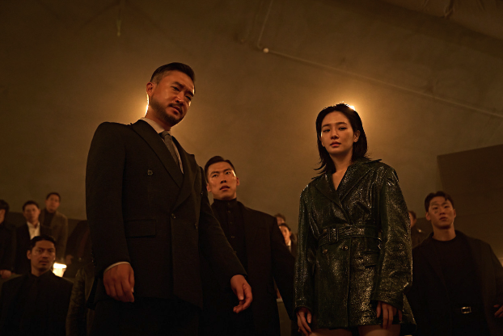
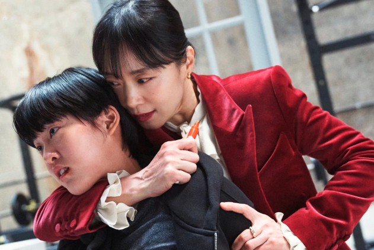
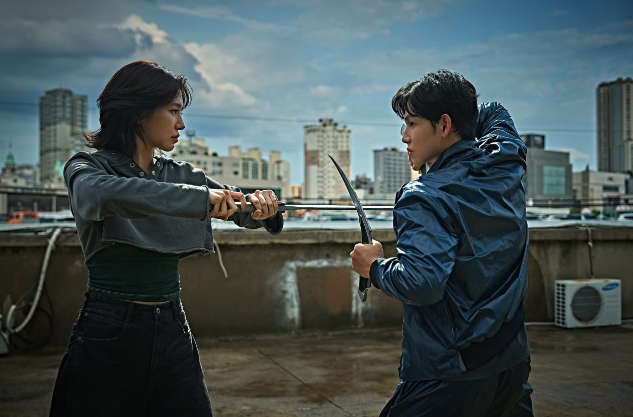
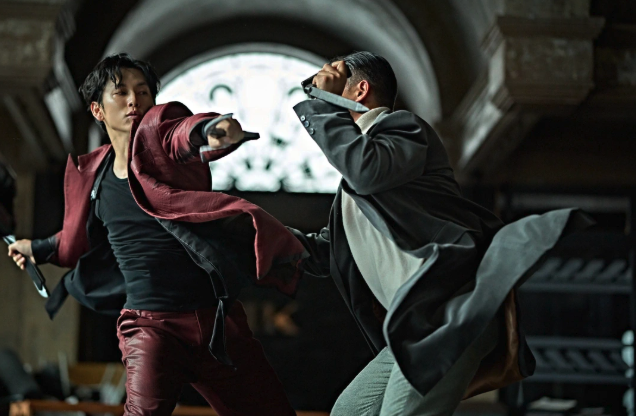

## 넷플릭스 영화 '사마귀', 룰이 사라진 킬러들의 세계로 당신을 초대합니다

2025년 9월 26일, 넷플릭스가 야심 차게 선보인 한국 액션 스릴러 영화 **'사마귀'(Mantis)**가 전 세계 시청자들의 이목을 집중시켰습니다. 2023년 공개되어 큰 화제를 모았던 영화 '길복순'의 스핀오프 작품으로, 동일한 킬러 세계관을 배경으로 더욱 확장된 이야기를 펼쳐냅니다.

이태성 감독이 연출을 맡고 임시완, 박규영, 조우진 등 믿고 보는 배우들이 뭉쳐 공개 전부터 기대를 한 몸에 받았죠. 하지만 개봉 후 국내와 해외에서 극명하게 엇갈린 평가를 받으며 '사마귀'를 둘러싼 궁금증은 더욱 커지고 있습니다. 과연 '사마귀'는 어떤 영화일까요? 지금부터 룰이 무너진 킬러들의 세계로 함께 떠나보겠습니다.

### 영화 '사마귀' 기본 정보

*   **제목**: 사마귀 (Mantis)
*   **개봉일**: 2025년 9월 26일 (넷플릭스 단독 공개)
*   **장르**: 액션, 느와르, 스릴러, 드라마, 범죄, 블랙 코미디, 로맨스, 고어, 피카레스크
*   **러닝타임**: 111분 ~ 113분 (약 1시간 51분 ~ 53분)
*   **관람등급**: 청소년 관람불가 (19금)
*   **감독**: 이태성 (장편 데뷔작)
*   **각본**: 변성현, 이태성, 이진성 (변성현 감독 크리에이터 참여)
*   **제작사**: 씨앗필름 (SEE AT Film Co., LTD.)
*   **배급사**: 넷플릭스

---

## 스토리: 룰이 사라진 킬러들의 무자비한 경쟁

영화 '사마귀'는 A급 킬러 '한울'(임시완 분)이 긴 휴가에서 돌아오면서 시작됩니다. 그가 돌아온 살인청부업계는 MK 엔터 대표 '차민규'(설경구 특별출연)의 죽음 이후 모든 규칙이 무너진 혼돈의 시대입니다. 한울은 이 무너진 질서 속에서 훈련생 동기이자 오랜 라이벌인 '재이'(박규영 분), 그리고 은퇴한 레전드 킬러 '독고'(조우진 분)와 함께 킬러 업계의 1인자 자리를 놓고 치열한 대결을 펼치게 됩니다.

한울은 이 혼란을 기회 삼아 '사마귀 컴퍼니'를 설립하고, 재이는 그런 한울을 중심으로 새로운 길을 모색합니다. 한편, 독고는 차민규의 죽음 이후 MK 엔터의 대표 자리에 오르며 사마귀를 다시 영입하려 하죠. 스승과 제자, 친구이자 라이벌이라는 복잡하게 얽힌 관계 속에서 각자의 욕망을 쫓는 킬러들의 이야기가 긴장감 넘치게 그려집니다.

### '길복순' 세계관과의 연결고리

'사마귀'는 넷플릭스 한국 오리지널 영화 중 최초의 스핀오프 작품으로, '길복순'과 동일한 킬러 세계관을 공유합니다. '길복순'에서 차민규가 "사마귀도 돌아오면 세대교체 해야지"라고 언급했던 바로 그 '사마귀'가 주인공 한울입니다. 영화는 MK 엔터의 세 가지 룰(회사 허가 작품만 수행, 미성년자 살해 금지, 의뢰받은 일만 처리) 등 전작의 설정을 바탕으로 세계관을 더욱 확장합니다. '길복순'의 주인공 '길복순'(전도연 특별출연) 역시 짧지만 강렬한 카메오로 등장해 세계관의 연결성을 강화합니다.

---

## 캐릭터 분석: 누가 최강의 킬러인가?

### 임시완 - 한울 (사마귀) 역

천부적인 재능을 타고난 A급 킬러 '한울'. 그의 별명 '사마귀'는 양손에 낫을 들고 곤충 사마귀의 움직임을 본뜬 독특한 액션 스타일에서 비롯됩니다. 임시완은 오만함과 연민을 오가는 예측 불가능한 한울의 모습을 훌륭하게 표현했으며, 액션 장르에 처음 도전하며 복싱, 킥복싱, 당랑권 등 다양한 무술을 연습하는 투혼을 보여주었습니다. 캐릭터의 화려한 패션 센스 또한 'MZ 킬러'라는 설정에 한몫합니다.

### 박규영 - 재이 역

한울의 훈련생 동기이자 라이벌인 '재이'는 피나는 노력으로 정상급 실력을 갖춘 노력형 킬러입니다. 한울에게 복합적인 감정, 즉 친구 이상의 미묘한 감정과 동시에 열등감을 느끼는 인물이죠. 박규영은 첫 영화 주연작임에도 불구하고 킬러 역할을 위해 체지방을 14%까지 감량(일부 보도에선 7.9%까지 언급)하며 탄탄한 몸을 만들고 액션 스쿨에서 맹훈련을 거쳐 감각적인 검 액션을 완벽하게 소화해냈습니다. 그녀의 섬세한 감정 연기는 한울과의 관계성을 더욱 밀도 있게 만듭니다.

### 조우진 - 독고 역

MK 엔터의 창립 멤버이자 한울의 스승이었던 은퇴한 레전드 킬러 '독고'. 차민규의 죽음 이후 혼탁해진 킬러 업계를 바로잡기 위해 다시 등장하며, 톤파를 주 무기로 묵직하고 노련한 액션을 선보입니다. 조우진 배우는 대부분 조용하지만 필요할 때 압도적인 존재감을 드러내는 독고의 모습을 탁월하게 연기하며 극의 중심을 잡아줍니다.

---

## 스펙터클 액션: 눈을 뗄 수 없는 잔혹미학

'사마귀'는 킬러들의 치열한 싸움을 그린 만큼, 스타일리시하고 박진감 넘치는 액션 연출에 많은 공을 들였습니다. 이태성 감독은 '길복순'보다 한층 더 무협 같은 액션 스타일을 선보이며, 각 캐릭터의 시그니처 무기를 통해 개성을 부여했습니다.

*   **사마귀의 낫**: 한울은 양손에 낫을 들고 사마귀처럼 빠르고 날렵한 움직임을 보여줍니다.
*   **재이의 검**: 박규영은 긴 장검을 활용해 우아하면서도 날카로운 액션을 선보이며, 체격적 차이를 극복하는 영리한 싸움 방식을 보여줍니다.
*   **독고의 톤파**: 조우진은 묵직한 톤파를 휘두르며 베테랑 킬러의 무게감 있는 액션을 완성합니다.

배우들은 촬영 전부터 액션 스쿨에서 강도 높은 훈련을 받았고, 특히 박규영 배우는 액션 연기에 대한 강한 의지로 체지방 감량 등 엄청난 노력을 기울였습니다. 이들의 노력 덕분에 맨몸 액션과 무기 액션이 조화롭게 어우러지며 시청자들에게 강렬한 시각적 쾌감을 선사합니다. 액션 장면들은 단순한 볼거리를 넘어, 인물들의 감정과 심리 상태를 표현하는 대화의 연장선처럼 느껴집니다.

---

## 넷플릭스 유니버스의 확장: '사마귀'와 '오징어 게임'의 연결고리

'사마귀'가 단순한 스핀오프를 넘어 주목받는 이유는 핵심 배우들이 넷플릭스의 메가 히트작 **'오징어 게임'**의 새로운 시즌에도 연이어 출연하기 때문입니다.

*   **'오징어 게임' 합류 배우:** '사마귀'의 주연 배우인 **임시완**과 **박규영**, 그리고 특별 출연으로 강렬한 존재감을 보여준 **양동근**이 **'오징어 게임' 시즌 2와 3**의 출연자 명단에 이름을 올렸습니다.
*   **시사점:** 이처럼 넷플릭스의 기대작 두 편에 핵심 배우들이 연이어 출연하는 것은 넷플릭스가 이들의 **탄탄한 연기력과 화제성을 높이 신뢰**하고 있음을 보여주는 방증입니다다. 이는 '넷플릭스의 아들/딸'이라는 수식어가 붙을 만큼 긴밀한 협력 관계를 보여줍니다 
*   **관전 팁:** '사마귀'의 강렬한 느와르 액션에 매료된 시청자라면, 이 배우들이 '오징어 게임'이라는 또 다른 거대한 세계관 속에서 어떤 절박한 사연을 가진 **참가자로 등장**해 판도를 흔들지 비교하며 보는 재미가 클 것입니다.

---

## 뜨거운 해외 반응 vs. 엇갈린 국내 평가: 왜?

'사마귀'는 공개 직후 국내외에서 극명하게 엇갈린 평가를 받으며 화제를 모았습니다.

### 글로벌 흥행의 주역
영화는 공개 3일 만에 넷플릭스 비영어권 영화 글로벌 TOP 10에서 3위를 기록했고, 2주차에는 무려 2위까지 상승했습니다. 1,380만 시청 수(또는 680만 시청 시간)를 기록하며 한국을 포함한 57개국에서 TOP 10 리스트에 진입하는 등 해외에서 폭발적인 인기를 얻었죠. IMDb 평점도 7.5점으로 높은 편에 속합니다.

이러한 해외 반응은 액션이나 SF 같은 장르물이 시각적 연출과 동작 중심의 전개로 언어 장벽을 넘어 몰입감을 높이고, 정의, 복수, 생존과 같은 보편적인 테마가 전 세계 시청자들에게 쉽게 다가갔기 때문으로 분석됩니다.

### 냉담한 국내 평가
반면, 국내에서는 공개 초기 '오늘 대한민국의 톱10 영화' 1위를 차지하기도 했지만, 이후 빠르게 순위가 하락하여 '노이즈', '타로' 등에 밀려 3위권에 머물렀습니다. 네이버 영화 평점 3점대, 왓챠피디아 2점대 등 낮은 평점을 기록하며 혹평이 이어졌죠.

주요 비판점은 다음과 같습니다.
*   **서사의 공허함**: '길복순'이 가졌던 모성애라는 보편적 감정선이 상실되어 관객의 공감을 얻기 어려웠다는 지적.
*   **억지스러운 로맨스**: 한울과 재이의 맹목적인 감정선이 설득력을 잃고, 액션 영화에서 과하게 강조되어 몰입을 방해했다는 평.
*   **연출과 대사의 유치함**: 와이어 액션의 어색함, CG의 미숙함, 그리고 '중2병' 같다는 평가를 받은 대사들이 몰입도를 떨어뜨렸다는 의견.
*   **'길복순' 세계관 훼손**: 스핀오프라는 기대에 미치지 못하고, 오히려 본편의 정체성을 흐리고 익숙한 이야기를 반복했다는 비판.

국내 시청자들은 연기력, 연출, 서사의 완성도에 민감하게 반응하는 경향이 있어, 이러한 비판점들이 국내 흥행 부진으로 이어진 것으로 보입니다.

---

## 결론: 넷플릭스 '사마귀', 당신의 선택은?

넷플릭스 영화 '사마귀'는 스타일리시하고 강렬한 액션, 그리고 주연 배우들의 뛰어난 연기 변신을 통해 시각적인 즐거움을 선사하는 작품임에는 틀림없습니다. 특히 임시완, 박규영 배우의 새로운 액션 도전과 조우진 배우의 묵직한 존재감은 영화의 큰 장점입니다.

하지만 '길복순'의 스핀오프라는 높은 기대치에 비해 스토리텔링과 서사의 깊이 면에서는 아쉬움이 남는다는 평가도 존재합니다. 예측 가능한 전개, 과하게 강조된 로맨스, 그리고 다소 유치하게 느껴질 수 있는 연출은 국내 시청자들의 공감을 얻기 어려웠던 부분입니다.

그럼에도 불구하고 화려한 액션과 멋진 영상미, 그리고 킬러 세계관의 확장에 관심이 있는 관객이라면 한 번쯤 시청해 볼 만한 가치는 충분합니다. 넷플릭스에는 동명의 프랑스 스릴러 드라마 '사마귀(La Mante)'도 있으니 혼동하지 않도록 주의하세요!
