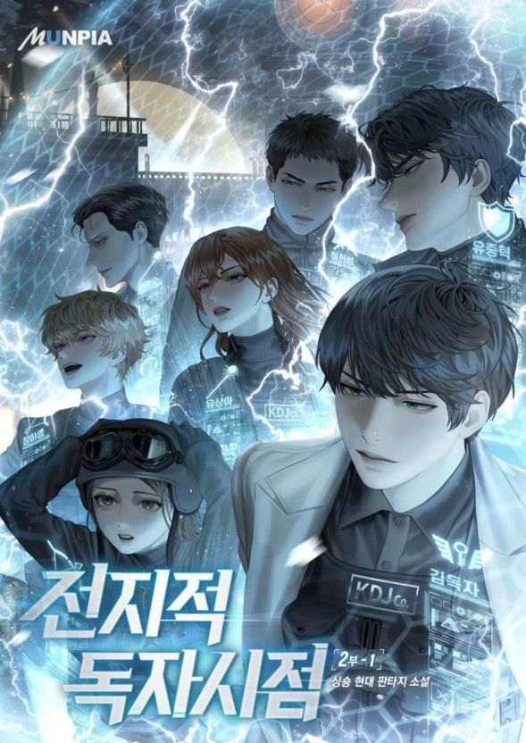

수많은 팬들이 간절히 기다려온 소식이 드디어 도착했습니다. 웹소설계의 전설 **'전지적 독자 시점(전독시)'**의 영화 개봉일이 확정된 것입니다. 독자들의 상상 속에서만 존재하던 웅장한 세계관과 매력적인 캐릭터들이 마침내 스크린을 통해 우리 앞에 모습을 드러냅니다.

<!--more-->

## 🎬 2025년 7월 23일, 마침내 시작될 이야기

'전지적 독자 시점'의 극장 개봉일이 **2025년 7월 23일**로 공식 확정되었습니다. 긴 기다림 끝에 공개된 개봉일 소식에 원작 팬들과 영화 팬들의 기대감이 절정에 달하고 있습니다.

'더 테러 라이브', 'PMC: 더 벙커' 등으로 감각적인 연출력을 입증한 **김병우 감독**이 연출을 맡아, 소설 속 멸망한 세계와 그 안에서 펼쳐지는 성좌들의 전쟁을 어떻게 스크린에 담아낼지 업계의 시선이 집중되고 있습니다.

## ⭐ 상상 속 인물들이 현실로, 초호화 캐스팅 라인업

'전지적 독자 시점'은 개봉 소식과 함께 화려한 캐스팅으로 다시 한번 화제의 중심에 섰습니다.

[이하 캐스팅 부분은 원문 그대로 유지]

## 🔍 이지혜 역의 지수, 기대와 우려 사이

이번 캐스팅에서 가장 뜨거운 관심을 받은 인물은 **'이지혜' 역을 맡은 블랙핑크의 지수**입니다. 이번 영화로 스크린에 정식 데뷔하는 만큼, 전 세계적인 기대와 함께 연기력에 대한 우려의 시선도 공존하고 있습니다.

### 기대 요소
- 글로벌한 인지도
- 원작 캐릭터와의 놀라운 비주얼 싱크로율

### 우려 요소
- '설강화'에서 보였던 연기력에 대한 엇갈린 평가

이에 대해 김병우 감독은 최근 인터뷰에서 지수 캐스팅의 의미를 명확히 설명했습니다.

> "이지혜 캐릭터는 영화 중후반부에 등장하기에 순간적인 존재감이 중요했다. 지수 배우만이 줄 수 있는 특별한 존재감으로 관객들의 시선을 사로잡을 것이다."
> 
> **- 김병우 감독**

지수가 이번 작품을 통해 배우로서의 가능성을 증명하고 대중의 우려를 기대로 바꿀 수 있을지, 그녀의 연기는 '전지적 독자 시점'의 중요한 관전 포인트가 될 전망입니다.

## 🌍 제작사와 해외의 뜨거운 관심

'신과 함께' 시리즈로 한국형 판타지 영화의 새로운 지평을 연 **리얼라이즈픽쳐스**가 제작을 맡아 원작의 방대한 스케일과 깊이 있는 메시지를 스크린에 고스란히 옮겨 담을 것으로 기대를 모으고 있습니다.

이미 '전지적 독자 시점'은 국내를 넘어 해외에서도 뜨거운 관심을 받고 있습니다. 최근 미국, 일본, 캐나다 등 **전 세계 113개국에 선판매**되는 쾌거를 이루며 K-콘텐츠의 위상을 다시 한번 입증했습니다.

---

## 📅 영화 정보 요약

| 항목 | 내용 |
|------|------|
| **개봉일** | 2025년 7월 23일 |
| **감독** | 김병우 |
| **제작사** | 리얼라이즈픽쳐스 |
| **해외 선판매** | 113개국 |
| **장르** | 판타지, 액션 |

---

오랜 기다림 끝에 우리 곁을 찾아올 영화 '전지적 독자 시점'. 소설의 마지막 장을 넘긴 그날, 세상의 멸망과 함께 시작된 김독자의 장대한 여정을 이제 스크린으로 직접 확인해 보시기 바랍니다. 

**2025년 여름, 극장가 최고의 기대작이 될 '전지적 독자 시점'의 행보를 주목해 주세요.**


💡 **팁**: 원작 웹소설을 먼저 읽고 영화를 관람하면 더욱 깊이 있는 감상이 가능합니다!
