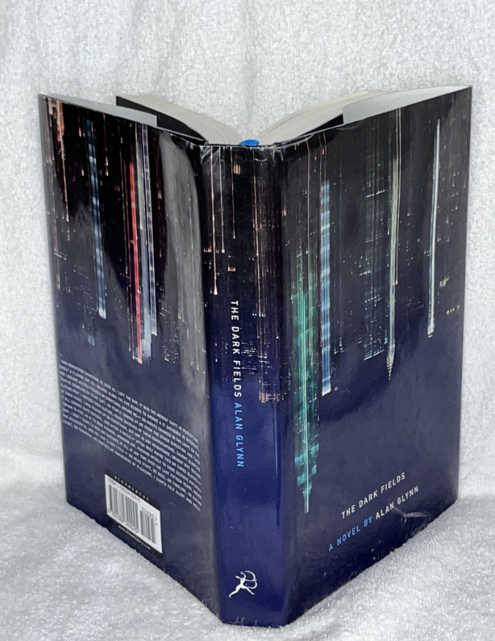
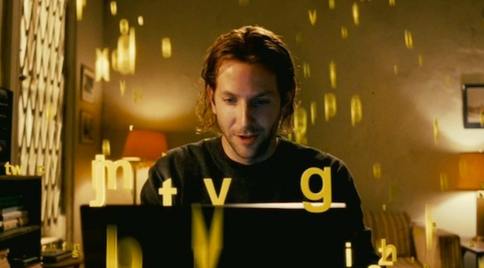

"만약 당신의 뇌를 100% 사용할 수 있게 해주는 약이 있다면, 드시겠습니까?"

영화 **<리미트리스(Limitless, 2011)>**는 이처럼 짜릿하고도 위험한 상상력에서 출발합니다. **앨런 글린의 소설 <The Dark Fields>를 원작**으로 하는 이 영화는, 무능력하고 의욕 없는 작가 '에디 모라'(브래들리 쿠퍼)가 우연히 뇌의 기능을 극한까지 끌어올리는 신약 'NZT-48'을 손에 넣게 되면서 겪는 인생의 급변을 다룬 SF 스릴러입니다. 단순한 액션 영화를 넘어, 성공, 야망, 그리고 그 대가에 대한 깊은 질문을 던지는 영화입니다.

## 지옥에서 천국으로: 하루아침에 달라진 인생

주인공 **에디 모라**는 마감 압박에 시달리면서도 단 한 줄도 쓰지 못하는 최악의 슬럼프에 빠진 작가입니다. 지저분한 방, 텅 빈 통장, 그리고 그를 떠나간 여자친구까지. 그의 인생은 그야말로 '총체적 난국'입니다.

그러던 어느 날, 그는 전처의 동생을 통해 정체불명의 신약 **NZT-48**을 얻게 됩니다. 반신반의하며 약을 삼킨 순간, 그의 세상은 180도 달라집니다. 뇌의 모든 기능이 활성화되면서, 한번 본 것은 무엇이든 기억하고, 복잡한 계산은 순식간에 해내며, 며칠 밤낮을 새워도 지치지 않는 초인이 됩니다.

며칠 만에 걸작 소설을 완성하고, 순식간에 여러 개의 외국어를 습득하며, 주식 시장을 예측해 엄청난 돈을 벌어들입니다. 그의 눈앞에 펼쳐진 세상은 더 이상 한계가 없는 '리미트리스' 그 자체였습니다. 영화는 에디의 변화를 시각적으로 탁월하게 표현합니다. 약을 먹기 전의 어둡고 칙칙한 화면은 약을 먹은 후 선명하고 화려한 색감으로 바뀌며, 관객마저 NZT-48을 복용한 듯한 황홀경에 빠지게 만듭니다.

## 성공의 그림자: 달콤한 유혹 뒤의 위험한 대가

하지만 세상에 공짜는 없는 법. NZT-48이 가져다준 눈부신 성공 뒤에는 치명적인 부작용과 위험이 도사리고 있었습니다. 약효가 떨어지면 극심한 두통과 구토에 시달리고, 장기 복용 시 기억을 잃거나 목숨을 잃을 수도 있다는 사실을 알게 됩니다.

설상가상으로, 이 약의 존재를 아는 어둠의 세력들이 그의 목숨을 위협하기 시작합니다. 에디는 자신의 천재적인 능력을 유지하기 위해, 그리고 살아남기 위해 점점 더 위험한 선택을 하게 됩니다. 영화는 이 지점에서 단순한 성공 스토리가 아닌, 인간의 끝없는 야망과 그로 인한 도덕적 딜레마를 파고드는 스릴러로 변모합니다.

과연 약으로 얻은 능력은 진짜 '내 것'일까요? 우리는 성공을 위해 어디까지 갈 수 있을까요? <리미트리스>는 관객에게 이러한 질문을 끊임없이 던지며 긴장감을 늦추지 않습니다.

## 원작 소설과 또 다른 상상력: 영화 <루시>

<리미트리스>는 앨런 글린의 2001년 소설 **<The Dark Fields>**를 원작으로 합니다. 영화는 원작의 핵심적인 설정을 가져오면서도, 조금 더 대중적이고 속도감 있는 스릴러로 각색되었습니다. 원작이 약물에 대한 어두운 탐구와 주인공의 내적 고뇌에 더 집중한다면, 영화는 성공과 야망이라는 주제를 화려한 시각 효과와 함께 풀어냅니다.

'뇌의 잠재력을 최대로 끌어쓴다'는 소재는 스칼렛 요한슨 주연의 영화 **<루시(Lucy, 2014)>**에서도 찾아볼 수 있습니다. <루시> 역시 우연히 신종 약물을 흡수하게 된 주인공이 초인적인 능력을 얻게 된다는 점에서 <리미트리스>와 시작은 비슷합니다. 하지만 <리미트리스>가 약을 통해 얻은 능력으로 사회적 성공과 권력을 쟁취하려는, 비교적 현실에 발붙인 스릴러에 가깝다면, <루시>는 뇌 사용량이 100%에 가까워지면서 인간을 초월한 존재가 되어가는 과정을 그리는, 더욱 철학적이고 형이상학적인 SF 액션으로 나아간다는 차이점이 있습니다.

두 영화를 비교하며 보는 것도 흥미로운 감상 포인트가 될 것입니다.

## 총평: 짜릿한 상상력과 현실적인 메시지의 조화

**<리미트리스>**는 '뇌를 100% 사용한다'는 흥미로운 설정을 통해 관객의 상상력을 자극하는 동시에, 성공과 야망이라는 현실적인 주제를 놓치지 않는 영리한 영화입니다. 브래들리 쿠퍼의 연기는 무기력한 루저에서 자신감 넘치는 천재로 변모하는 과정을 설득력 있게 보여주며, 속도감 있는 연출은 105분의 러닝타임을 순식간에 지나가게 만듭니다.

단순한 킬링타임용 영화를 넘어, 자신의 잠재력과 성공의 의미에 대해 한번쯤 생각해볼 기회를 주는 작품입니다.

**만약 당신에게 NZT-48 한 알이 주어진다면, 어떤 선택을 하시겠습니까?**