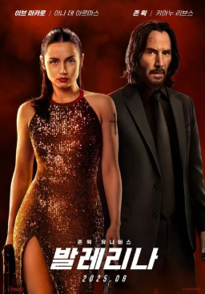

# 🩰 발레리나 (Ballerina) - 존 윅 유니버스의 새로운 복수 이야기


## 📝 기본 정보

- **장르**: 액션, 스릴러
- **개봉일**: 2025년 6월 6일 (북미), 8월 6일 (한국)
- **감독**: 렌 와이즈먼
- **각본**: 셰이 해튼
- **주연**: 아나 데 아르마스
- **배급**: 라이언스게이트 (북미), 판씨네마㈜ (한국)

## 🎬 작품 소개

존 윅 유니버스의 첫 번째 여성 주인공 스핀오프 작품으로, **존 윅 3 이후와 존 윅 4 이전** 사이의 시간대를 배경으로 합니다. "더 거칠고 더 날카롭게 복수의 룰을 부숴라"라는 캐치프레이즈와 함께 새로운 복수 이야기를 선보입니다.

## 🎭 줄거리

살해당한 아버지의 복수를 원하는 **'이브'**는 전설적인 킬러 '존 윅'을 배출한 암살자 양성 조직 **루스카 로마**에서 혹독한 훈련을 받아 발레리나이자 킬러로 성장합니다. 

아버지의 죽음에 얽힌 자들을 쫓던 이브는 루스카 로마를 뛰어넘는 거대한 조직의 정체를 알게 되고, 킬러들의 표적이 된 상황에서 **존 윅**과 만나게 됩니다.

> **EVE Meets WICK** - 새로운 복수의 시작, 존 윅 유니버스가 확장된다!

## 🌟 주요 캐스팅

### 메인 캐스트
- **아나 데 아르마스** - 이브 역 (주인공)
- **키아누 리브스** - 존 윅 역 (특별출연)
- **이언 맥셰인** - 윈스턴 역
- **안젤리카 휴스턴** - 발레리나들의 감독 역

### 한국 배우
- **최수영** - 카틀라 박 역
- **정두홍** - 일성 역

### 추가 캐스트
- **샤론 던컨브루스터**
- **랜스 레딕** (故) - 카론 역

## 🇰🇷 한국 배우들의 존 윅 유니버스 입성

### 정두홍 - 액션의 대가가 만든 특별한 대결



**대한민국을 대표하는 무술감독이자 배우 정두홍**이 '일성' 역으로 출연하여 아나 데 아르마스와 파워풀한 대결을 펼칩니다.

#### 캐스팅 비하인드
> "채드 스타헬스키 감독이 존 윅 3: 파라벨룸 때 먼저 출연 제안을 줬었다. 그러나 그때 사정이 있어 합류하지 못했는데, 발레리나로 다시 연락을 주셔서 함께 하게 됐다."

#### 액션 콘셉트
- **한국적인 무술 스타일** 구현
- **태권도 스타일의 액션** 선보일 예정
- 기존 존 윅 시리즈와 차별화된 한국 무술 액션

### 최수영 - K-POP 스타에서 글로벌 배우로



**소녀시대 출신 최수영**이 '카틀라 박' 역으로 출연하여 **이브의 첫 미션 보호 대상**으로 등장합니다.

#### 캐릭터의 중요성
> "카틀라가 등장하는 장면은 이브가 암살자로서 자신을 자각하며 처음으로 무너지는 순간이다."

#### 연기 준비 과정
- 캐릭터 배경 설정을 직접 상상하며 준비
- "카틀라가 느끼는 두려움과 살아남고자 하는 욕망, 복잡한 감정들" 표현에 집중
- 아나 데 아르마스와의 긍정적인 협업

#### 아나 데 아르마스 평가
> "아나는 정말 좋은 사람이다. 내가 이 팀의 일원이라고 느끼게 해줬다. 배우로서 그녀가 멋진 점은 항상 자신의 캐릭터에 완전히 몰입해 있다는 거다."

## 🎵 사운드트랙

### 음악 감독
- **타일러 베이츠** (Tyler Bates)
- **조엘 J. 리처드** (Joel J. Richard)

### 주제곡
**"Hand That Feeds (From the Film Ballerina)"**
- **아티스트**: Halsey, Amy Lee & Evanescence
- **발매일**: 2025년 5월 9일
- **재생시간**: 3:06



## 🎯 제작 배경과 흥미로운 이야기들

### 프로젝트 시작
1. **2017년**: 셰이 해튼이 집필한 독립 각본으로 시작 (당시 존 윅과 무관)
2. **2018년**: 각본이 할리우드 블랙리스트에 등재
3. **2019년**: 렌 와이즈먼 감독 확정
4. **2021년**: 아나 데 아르마스 캐스팅 협상 시작

### 특별한 캐스팅 조건

아나 데 아르마스의 출연 조건이 **여성 각본가 참여**였으며, 5-6명의 여성 각본가와 접촉 후 **에메랄드 페넬**을 최종 선택했습니다.


### 대규모 재촬영 이슈
- **2024년 2월**: 개봉일이 2025년 6월로 1년 연기
- **재촬영 이유**: 액션신 부족이 아닌 내부 시사회 평가 개선을 위해
- **결과**: 중저예산 장르 영화에서 블록버스터로 격상

### 각본 크레딧 변화
최종적으로 **셰이 해튼 단독 크레딧**으로 확정:
- 에메랄드 페넬
- 렌 와이즈먼  
- 마이클 핀치

이들의 기여가 미국 작가 조합에서 인정받지 못함

## 📊 해외 평가 및 반응

### 평점 현황 (북미 개봉 후)

| 평가 사이트 | 점수 | 비고 |
|------------|------|------|
| **IMDb** | 7.0/10 | 사용자 평점 |
| **로튼 토마토** | 신선도 76% | 비평가 점수 |
| **로튼 토마토** | 관객 점수 92% | 일반 관객 |
| **메타크리틱** | 59/100 | 메타스코어 |

### 평가 포인트

#### ✅ 장점들
- **뛰어난 액션 시퀀스와 안무**
- **존 윅 본편을 능가하는 미술과 영상미**  
- **아나 데 아르마스의 카리스마틱한 연기**
- **한국 배우들의 매력적인 연기와 액션**
- **렌 와이즈먼 특유의 미장센**

#### ⚠️ 단점들
- **다소 단순하고 예측 가능한 스토리라인**
- **뻔한 각본 구조**


전형적인 **렌 와이즈먼 영화의 특징**인 "뛰어난 액션, 미술, 디자인 vs 부족한 각본"이라는 평가를 받고 있습니다.


## 🎪 기대 포인트와 관전 포인트

### 액션의 진화
- **발레리나 + 킬러** 컨셉의 조화
- **정두홍의 태권도 스타일** 액션
- **렌 와이즈먼식 좁은 공간 액션**
- **존 윅 시리즈 정교한 액션 디자인**

### 스토리적 의미
- 존 윅 3과 4 사이의 **미싱 링크** 역할
- 여성 주인공 중심의 **복수 서사**
- **루스카 로마** 조직의 확장된 세계관

### 한국적 요소
- **K-POP 스타의 글로벌 진출**
- **한국 무술의 세계적 인정**
- **동서양 액션의 조화**

## 🎬 상영 정보

### 국내 개봉
- **개봉일**: 2025년 8월 6일
- **배급사**: 판씨네마㈜

## 🔮 전망 및 기대효과

### 박스오피스 전망
- **북미 개봉 성과**를 바탕으로 한 국내 흥행 기대
- **존 윅 브랜드 파워** + **아나 데 아르마스 인지도**
- **한국 배우 출연**으로 인한 화제성

### 시리즈 확장 가능성
- 존 윅 유니버스의 **성공적인 확장** 사례
- 여성 주인공 액션 영화의 **새로운 기준**
- **속편 제작 가능성** 높음

---

## 📝 마무리

존 윅 유니버스의 확장과 함께 **한국 배우들의 글로벌 진출**이 동시에 이뤄지는 특별한 작품입니다. 

**정두홍의 태권도 액션**과 **최수영의 감정 연기**, 그리고 **아나 데 아르마스의 카리스마**가 어떤 시너지를 만들어낼지 기대가 됩니다.

🎬 과연 이브의 복수는 어떤 결말을 맞이할까요? 8월 6일, 극장에서 확인해보세요! 