넷플릭스 연애 리얼리티 `불량 연애` 시즌1은 일본어 제목 `ラヴ上等`, 영어 제목 `Badly in Love`로 공개된 작품입니다. 시즌2를 보기 전에 시즌1의 출연진, 공개 일정, 주요 러브라인, 결말을 한 번 정리해두면 시즌2의 분위기와 프로그램 콘셉트를 이해하기 훨씬 쉽습니다.

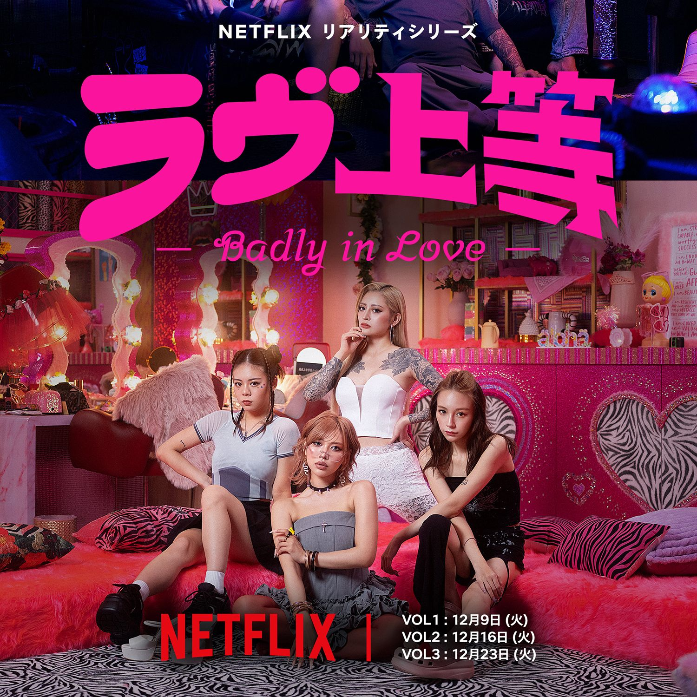

이 글에서는 시즌1의 공개일, 출연진, 주요 러브라인, 최종 선택과 결말까지 시즌2를 보기 전에 알아두면 좋은 내용을 한 번에 정리합니다.

## 불량 연애 시즌1 기본 정보

`불량 연애` 시즌1은 사회의 바깥에서 살아왔다고 소개된 남녀 11명이 14일 동안 학교에서 공동생활을 하며 사랑을 찾아가는 연애 리얼리티입니다. Netflix 공식 소개에 따르면, 참가자들은 충돌과 고백을 반복하며 본기 있는 사랑을 추구하는 구도로 진행됩니다.

| 항목 | 내용 |
|---|---|
| 작품명 | 불량 연애 시즌1 |
| 일본어 제목 | ラヴ上等 |
| 영어 제목 | Badly in Love |
| 플랫폼 | Netflix |
| 장르 | 연애 리얼리티, 리얼리티 예능 |
| 총 회차 | 10부작 |
| 출연진 | 남성 6명, 여성 5명, 총 11명 |
| MC | MEGUMI, AK-69, 永野 |

## 불량 연애 시즌1 공개일

시즌1은 한 번에 전편이 공개되지 않고, 3주에 걸쳐 VOL1, VOL2, VOL3로 나뉘어 공개됐습니다.

| 구분 | 공개일 | 공개 회차 |
|---|---:|---:|
| VOL1 | 2025년 12월 9일 | 1~4화 |
| VOL2 | 2025년 12월 16일 | 5~7화 |
| VOL3 | 2025년 12월 23일 | 8~10화 |

이 분할 공개 방식은 시즌2에서도 이어졌습니다. 시즌1을 다시 볼 때도 1~4화는 첫인상과 초반 러브라인, 5~7화는 관계 변화, 8~10화는 최종 선택으로 나누어 보면 흐름이 더 잘 보입니다.

## 시즌1 출연진 요약

시즌1 출연진은 남성 6명, 여성 5명으로 구성됐습니다. 각자의 과거와 직업, 강한 캐릭터가 프로그램의 핵심 동력이었습니다.

### 남성 출연진 요약표

| 한글명 | 일본어 | 영어 표기 | 본명 | 나이 | 직업 |
|---|---|---|---|---:|---|
| 츠짱 | つーちゃん | Tsuchan | 塚原舜哉 | 30세 | 캬바쿠라 경영, 의류 사업 |
| 얀보 | ヤンボー | Yanbo | 西澤偉 | 30세 | 래퍼 |
| 밀크 | ミルク | Milk | 佐藤匠海 | 22세 | 건설업 |
| 태클 | タックル | Tackle | 津田祥 | 24세 | 분재업 |
| 니세이 | 二世 | Nisei | 櫻井二世 | 27세 | BAR 경영 |
| 텐텐 | てんてん | Tenten | 七星天星 | 25세 | 호스트 |

### 여성 출연진 요약표

| 한글명 | 일본어 | 영어 표기 | 본명 | 나이 | 직업 |
|---|---|---|---|---:|---|
| 오토상 | おとさん | Otosan | 乙葉 | 22세 | 접객업, 전문학생 |
| 키짱 | きぃーちゃん | Kiichan | 綺麗 | 23세 | 모델, 메이크업 강사 |
| 베이비 | Baby | Baby | 鈴木ユリア | 25세 | 탤런트, 도장 관련 업무 |
| 테카린 | てかりん | Tekarin | ひかる | 21세 | 접객업, 격투기 |
| 아모 | あも | Amo | AMO | 27세 | 댄서 |

시즌1은 출연자들의 개성이 강한 만큼, 이름과 직업만 봐도 관계 구도를 따라가는 데 도움이 됩니다. 특히 중도 합류자와 퇴학자가 생기면서 초반에 형성된 러브라인이 크게 흔들렸습니다.

### 츠짱

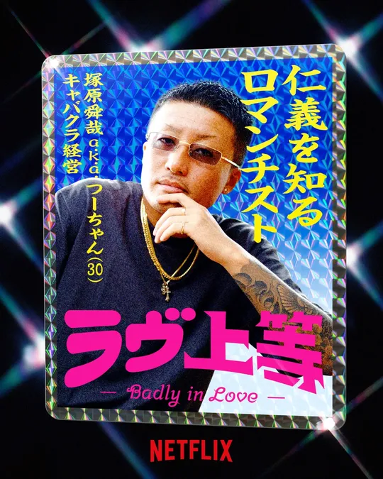

- 일본어/영어 표기: つーちゃん / Tsuchan
- 본명: 塚原舜哉
- 나이: 30세
- 직업: 캬바쿠라 경영, 의류 사업

츠짱은 시즌1 초반부터 강한 자신감과 리더십으로 존재감을 보여준 남성 출연자입니다. 여러 러브라인의 중심에 서면서 시즌1 후반부까지 큰 비중을 차지했습니다.

### 얀보

- 일본어/영어 표기: ヤンボー / Yanbo
- 본명: 西澤偉
- 나이: 30세
- 직업: 래퍼

얀보는 래퍼로 활동하는 출연자입니다. 초반에는 베이비를 향한 호감으로 러브라인을 만들었지만, 퇴학 이슈가 생기면서 시즌1의 큰 변곡점을 만든 인물입니다.

### 밀크

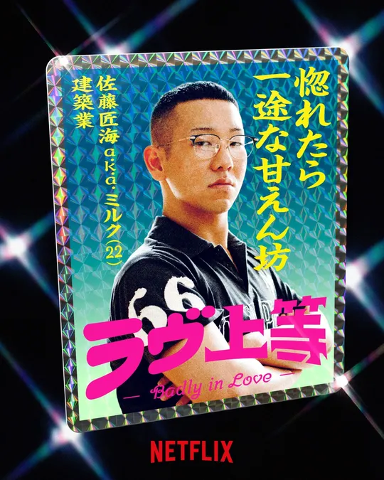

- 일본어/영어 표기: ミルク / Milk
- 본명: 佐藤匠海
- 나이: 22세
- 직업: 건설업

밀크는 남성 출연진 중 가장 어린 인물입니다. 순한 분위기와 진심 어린 태도로 주목받았고, 베이비를 향한 마음이 시즌1 러브라인의 한 축을 이뤘습니다.

### 태클

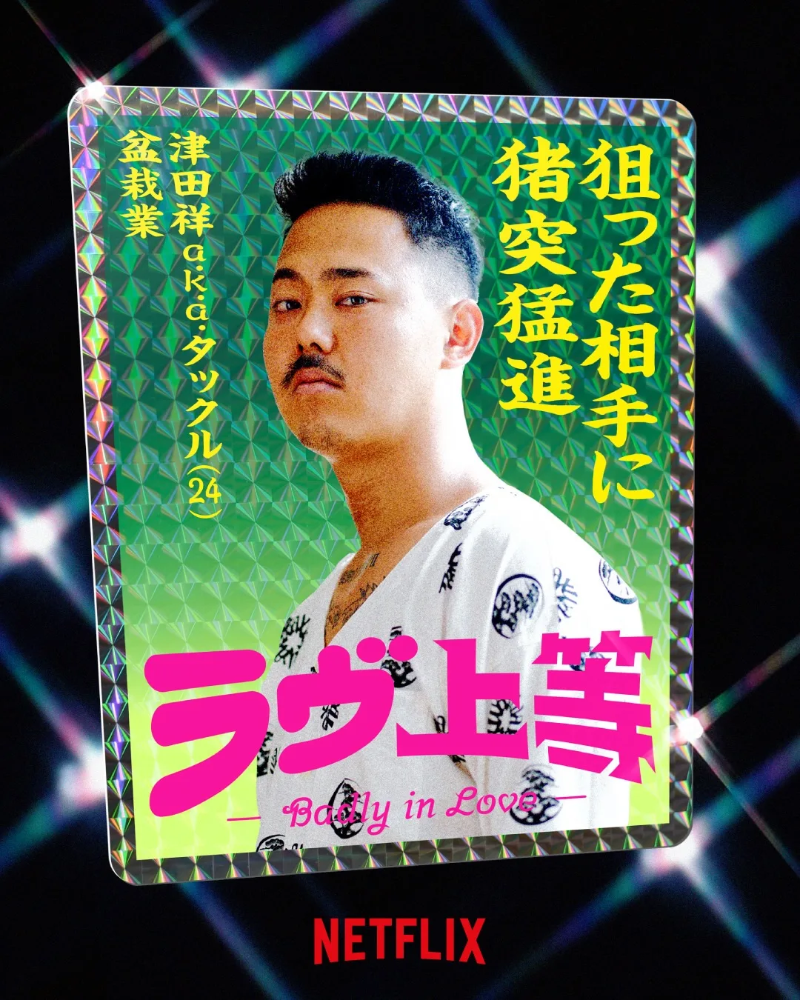

- 일본어/영어 표기: タックル / Tackle
- 본명: 津田祥
- 나이: 24세
- 직업: 분재업

태클은 분재업이라는 독특한 직업으로 소개된 출연자입니다. 키짱과의 초반 러브라인이 안정적으로 보였지만, 후반으로 갈수록 관계가 흔들리며 긴장감을 만들었습니다.

### 니세이

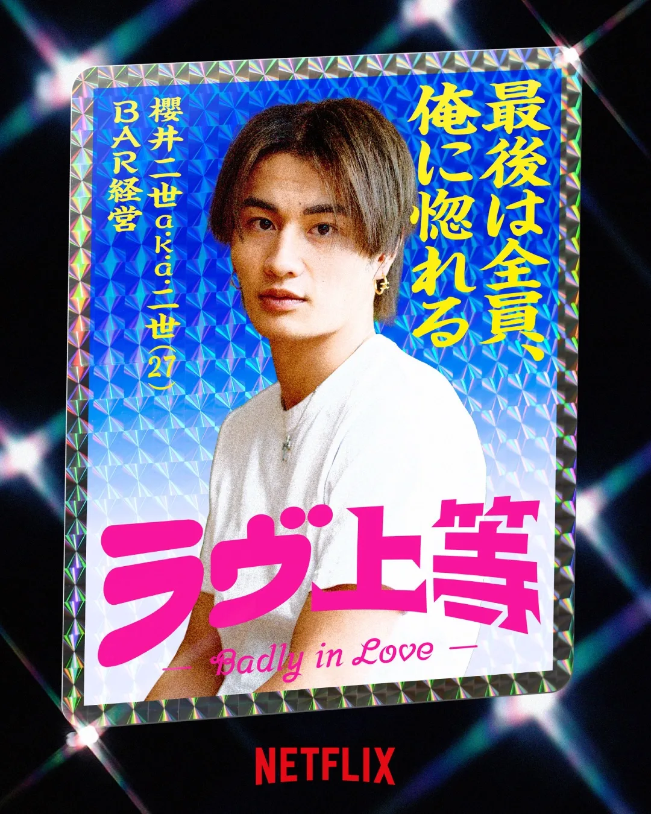

- 일본어/영어 표기: 二世 / Nisei
- 본명: 櫻井二世
- 나이: 27세
- 직업: BAR 경영

니세이는 BAR를 운영하는 출연자입니다. 베이비와 아모 사이에서 감정선이 복잡하게 움직이며, 시즌1 중후반부 러브라인을 흔든 인물로 볼 수 있습니다.

### 텐텐

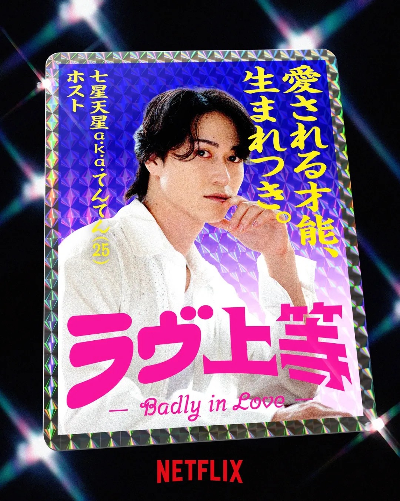

- 일본어/영어 표기: てんてん / Tenten
- 본명: 七星天星
- 나이: 25세
- 직업: 호스트

텐텐은 중도 합류한 남성 출연자입니다. 합류 이후 오토상과 깊은 대화를 나누며 새로운 러브라인을 만들었고, 후반부 관계 변화의 핵심 인물로 작용했습니다.

### 오토상

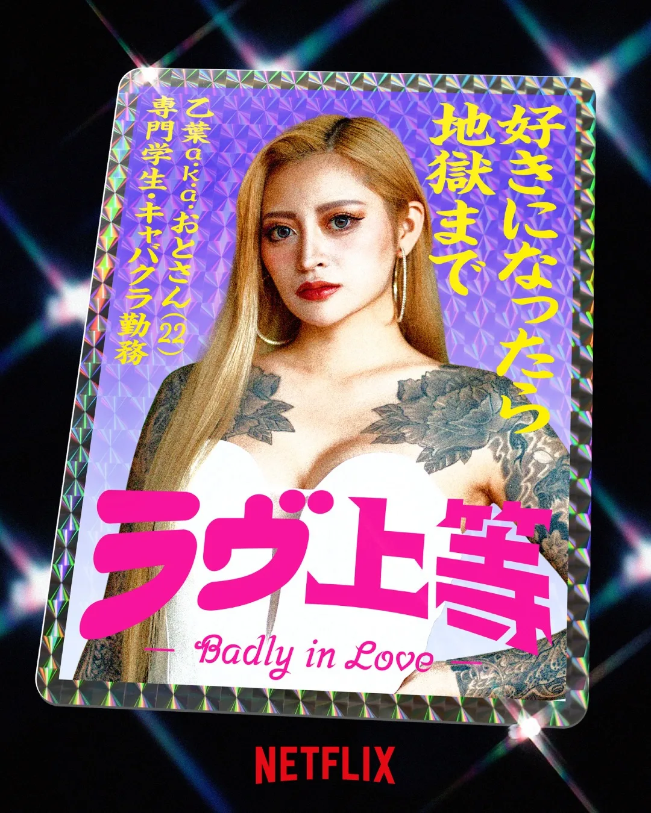

- 일본어/영어 표기: おとさん / Otosan
- 본명: 乙葉
- 나이: 22세
- 직업: 접객업, 전문학생

오토상은 시즌1에서 감정 표현이 뚜렷하게 드러난 여성 출연자입니다. 텐텐과 가까워지며 후반부에 중요한 러브라인을 형성했습니다.

### 키짱

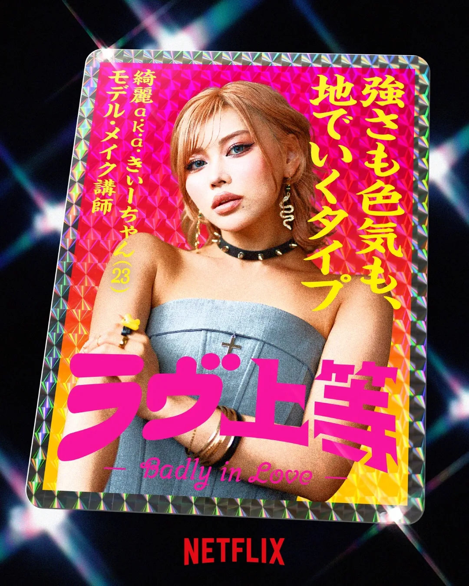

- 일본어/영어 표기: きぃーちゃん / Kiichan
- 본명: 綺麗
- 나이: 23세
- 직업: 모델, 메이크업 강사

키짱은 모델과 메이크업 강사로 활동하는 출연자입니다. 태클과의 초반 관계가 주목받았고, 이후 선택의 변화가 시즌1의 긴장감을 키웠습니다.

### 베이비

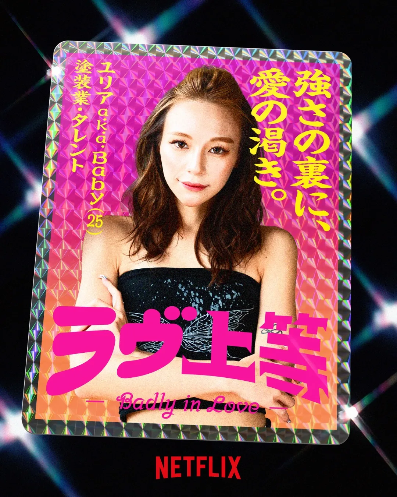

- 일본어/영어 표기: Baby / Baby
- 본명: 鈴木ユリア
- 나이: 25세
- 직업: 탤런트, 도장 관련 업무

베이비는 시즌1에서 가장 많은 러브라인과 연결된 인물 중 하나입니다. 얀보, 밀크, 니세이, 츠짱과의 감정선이 얽히며 시즌1 결말까지 큰 관심을 받았습니다.

### 테카린

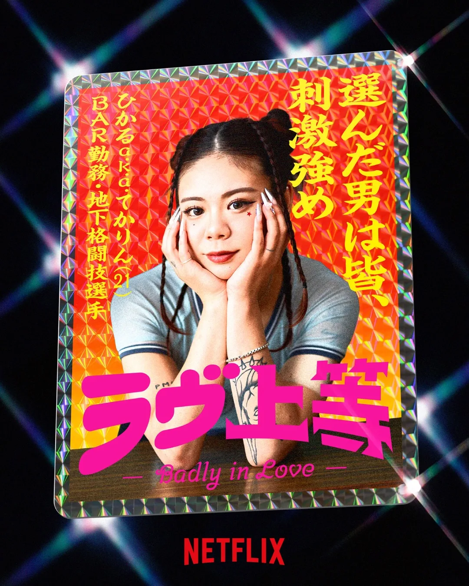

- 일본어/영어 표기: てかりん / Tekarin
- 본명: ひかる
- 나이: 21세
- 직업: 접객업, 격투기

테카린은 여성 출연진 중 가장 어린 출연자입니다. 얀보를 향한 감정선이 초반부에 크게 드러났고, 솔직한 반응으로 시청자들의 눈길을 끌었습니다.

### 아모

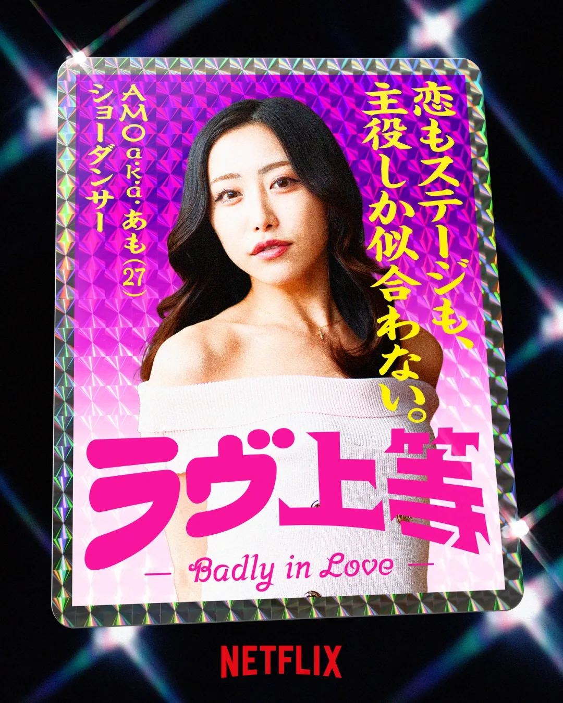

- 일본어/영어 표기: あも / Amo
- 본명: AMO
- 나이: 27세
- 직업: 댄서

아모는 댄서로 활동하는 출연자입니다. 후반부 니세이와의 감정선이 부각되며, 시즌1 러브라인을 더 복잡하게 만든 인물입니다.

## 시즌1 주요 러브라인

시즌1의 재미는 첫인상에서 시작된 호감이 중반 이후 계속 뒤집힌다는 점입니다. 특히 초반에는 익명 평가와 라브레터를 통해 첫 호감이 드러났고, 이후 데이트와 공동생활을 거치며 감정선이 크게 움직였습니다.

| 관계 | 흐름 |
|---|---|
| 태클 ↔ 키짱 | 초반 안정적으로 보였지만, 후반부로 갈수록 흔들림 |
| 얀보 → 베이비 | 초반 강한 호감이 있었지만, 퇴학 이슈로 흐름이 끊김 |
| 테카린 → 얀보 | 얀보의 약한 모습을 본 뒤 감정이 커짐 |
| 오토상 ↔ 텐텐 | 중도 합류 이후 서로의 과거를 공유하며 가까워짐 |
| 니세이 → 베이비 / 아모 | 중후반부에 감정선이 복잡해진 인물 |
| 츠짱 → 키짱, 베이비 | 초반과 후반의 감정선이 크게 달라진 핵심 인물 |
| 밀크 → 베이비 | 한때 베이비를 향한 마음이 강했지만 후반부에 흔들림 |

시즌1 러브라인은 초반, 중반, 최종 선택 직전의 분위기가 모두 다릅니다. 첫인상에서 시작된 호감이 끝까지 이어지지 않고, 중도 하차와 합류를 거치며 관계가 계속 바뀐 점이 핵심입니다.

## 중도 하차와 중도 합류

시즌1에서 가장 큰 변곡점 중 하나는 얀보의 퇴학과 텐텐의 합류입니다. 얀보는 초반 러브라인에서 존재감이 컸던 인물이었기 때문에, 그의 퇴학은 베이비와 테카린을 포함한 여러 관계에 영향을 줬습니다.

반대로 텐텐은 중도 합류 이후 오토상과 깊은 대화를 나누며 새로운 러브라인을 만들었습니다. 시즌1을 복습할 때는 이 두 사건을 기준으로 전반부와 후반부를 나누어 보면 관계 변화가 더 선명합니다.

## 시즌1 결말과 최종 선택

시즌1 최종화에서는 졸업식에서 각자의 마음을 전하는 방식으로 최종 선택이 진행됩니다. 다만 방송에서 보여준 `최종 선택`과 방송 이후의 실제 관계는 구분해서 볼 필요가 있습니다.

시즌1 결말에서 가장 많이 언급되는 축은 츠짱과 베이비의 관계입니다. 여러 리뷰와 방송 후 근황 글에서도 두 사람의 관계가 시즌1을 대표하는 러브라인으로 다뤄집니다. 반면 밀크, 니세이, 아모, 오토상 등은 최종 선택 전후의 감정선이 엇갈리며 여운을 남겼습니다.

시즌1의 결말은 마지막 선택만으로 끝나지 않습니다. 그 선택이 나오기 전까지 각 출연자의 감정선이 어떻게 바뀌었는지를 함께 봐야 러브라인의 흐름이 더 분명해집니다.

## 시즌2 보기 전 알아둘 점

시즌1과 시즌2는 출연진이 다르지만, 프로그램의 기본 문법은 이어집니다. 강한 첫인상, 과거 고백, 공동생활 속 갈등, 중도 합류, 마지막 선택이라는 흐름은 시즌2를 볼 때도 중요한 관전 포인트입니다.

시즌2를 보기 전 시즌1에서 기억해둘 포인트는 아래와 같습니다.

- 첫인상 선택이 끝까지 이어지지는 않는다.
- 중도 합류자는 러브라인을 크게 흔들 수 있다.
- 강한 캐릭터보다 솔직한 대화가 관계를 바꾸는 경우가 많다.
- 최종 선택과 방송 후 관계는 따로 봐야 한다.
- 시즌1의 인기는 시즌2 제작과 공개 방식에도 영향을 줬다.

## 공식 예고편과 관련 영상

시즌1 분위기는 Netflix 공식 작품 페이지의 예고편에서 가장 빠르게 확인할 수 있습니다. Netflix 공식 페이지에는 `시즌1 예고편: ラヴ上等` 영상이 등록되어 있으며, 작품의 콘셉트와 출연진의 첫인상이 짧게 담겨 있습니다.

- [Netflix 공식 페이지에서 시즌1 예고편 보기](https://www.netflix.com/jp/title/81769466)

아래 영상은 Netflix Japan 공식 채널에 올라온 MC진의 시즌1 관전 포인트 영상입니다. MEGUMI, AK-69, 永野가 출연진 11명의 매력과 프로그램의 분위기를 이야기합니다.



## 핵심 정보 정리

### 불량 연애 시즌1은 몇 부작인가요?

불량 연애 시즌1은 총 10부작입니다.

### 불량 연애 시즌1은 언제 공개됐나요?

시즌1은 2025년 12월 9일 VOL1을 시작으로, 12월 16일 VOL2, 12월 23일 VOL3까지 3주에 걸쳐 공개됐습니다.

### 불량 연애 시즌1 출연진은 몇 명인가요?

시즌1 출연진은 남성 6명, 여성 5명으로 총 11명입니다.

### 불량 연애 시즌1에서 가장 중요한 러브라인은 무엇인가요?

시즌1에서는 츠짱과 베이비, 태클과 키짱, 오토상과 텐텐, 니세이와 베이비·아모 사이의 감정선이 주요 러브라인으로 많이 언급됩니다.

### 시즌2 보기 전에 시즌1을 꼭 봐야 하나요?

시즌2는 출연진이 다르기 때문에 시즌1을 반드시 봐야 하는 것은 아닙니다. 다만 시즌1을 보면 프로그램의 룰, 분위기, 러브라인이 움직이는 방식을 더 쉽게 이해할 수 있습니다.

## 관련 글

- [불량 연애2 공개일·출연진 나이 직업 총정리](/posts/불량-연애2-공개일-출연진-총정리/)

## 참고 출처

- [Netflix 공식 소개](https://www.netflix.com/jp/title/81769466)
- [Netflix 공식 발표: 시즌1 공개 일정](https://about.netflix.com/ja/news/bady-in-love-premieres-december-9)
- [Netflix Japan 공식 YouTube: MC진이 말하는 시즌1 관전 포인트](https://www.youtube.com/watch?v=DjUGjx48uWs)
- [恋リア図鑑: 시즌1 출연진 프로필](https://www.ilpalazzovenezia.com/love-joto-members/)
- [ciatr: 시즌1 전 회차 결말·네타바레 정리](https://ciatr.jp/topics/334932)
- [BANGER!!!: 시즌1 키아트 및 최종화 보도](https://www.banger.jp/news/158745/)
