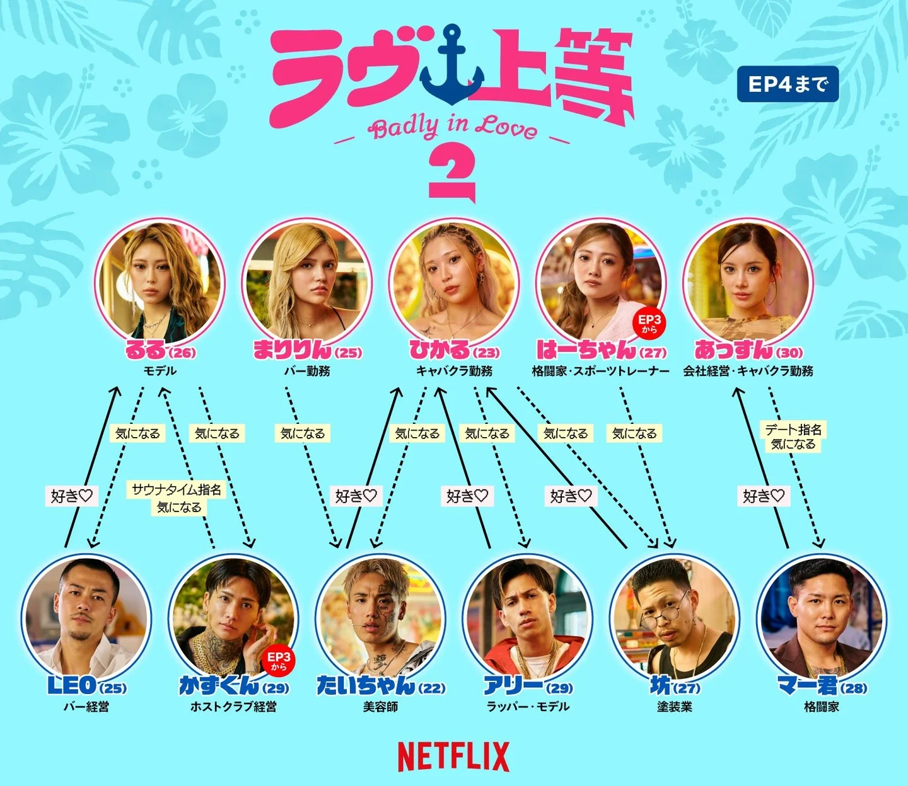

넷플릭스 `불량 연애2`는 EP4까지 공개되면서 출연자들의 호감 방향이 조금씩 드러나기 시작했습니다. 아직 확정 커플이 만들어진 단계는 아니지만, `관심`과 `좋아함♡`이 교차하면서 앞으로 러브라인이 크게 흔들릴 수 있는 구도가 만들어졌습니다.

이 글은 2026년 8월 10일 기준, Netflix Japan 공식 계정이 공개한 EP4까지의 호감도 관계도와 방송 내용을 바탕으로 정리했습니다. VOL2 이후 내용은 포함하지 않습니다.

## EP4 기준 호감도 보는 법

관계도에서는 출연자 사이의 감정이 크게 두 단계로 표현됩니다.

| 표현 | 의미 |
|---|---|
| 관심 | 아직 확정된 마음은 아니지만 더 알아보고 싶은 상태 |
| 좋아함♡ | 단순 관심보다 더 분명하게 호감을 표현한 상태 |
| 데이트 지명 | 상대와 시간을 보내고 싶다는 직접적인 선택 |

따라서 EP4 관계도는 `최종 커플`이 아니라 `현재 호감도`에 가깝습니다. 누가 누구에게 마음이 있는지, 그리고 그 마음이 일방향인지 쌍방향인지 보는 것이 핵심입니다.

## EP4 러브라인 요약

| 관계 | 현재 분위기 | 포인트 |
|---|---|---|
| LEO → 루루 | LEO의 마음이 비교적 분명함 | 루루도 LEO에게 관심이 있지만 카즈군도 지켜보는 중 |
| 타이짱 → 히카루 | 좋아함♡ | 히카루 삼파전의 한 축 |
| 아리 → 히카루 | 좋아함♡ | EP4 말미 아리의 눈물로 긴장감 상승 |
| 보 → 히카루 | 좋아함♡ | 히카루를 향한 세 번째 남성 출연자 |
| 히카루 → 타이짱·아리·보 | 관심 | 아직 한 명에게 확정되지 않은 상태 |
| 마군 → 앗슨 | 좋아함♡ | 관계도상으로는 비교적 선명한 호감 |
| 앗슨 → 마군 | 데이트 지명, 관심 | 다만 마군의 표현 부족에 불안함을 드러냄 |
| 루루 → 카즈군 | 사우나타임 지명, 관심 | LEO와 카즈군 사이에서 더 알아보는 분위기 |

EP4까지의 관계를 한 문장으로 요약하면, `히카루에게 몰린 세 남자`, `루루를 향한 LEO의 직진`, `앗슨과 마군의 온도 차`가 가장 큰 흐름입니다.

## 히카루에게 몰린 세 남자

EP4 기준 가장 복잡한 러브라인은 히카루를 중심으로 형성돼 있습니다. 타이짱, 아리, 보 세 사람이 모두 히카루에게 `좋아함♡`을 표현했고, 히카루 역시 세 사람 모두에게 `관심`을 보이고 있습니다.

즉 남성 출연자 세 명은 이미 히카루를 향한 마음을 어느 정도 분명히 드러냈지만, 히카루는 아직 누구 한 명에게 마음을 확정하지 않은 상태입니다. 관계도만 보면 히카루가 여러 선택지를 열어둔 상황이고, 방송 흐름상 이 부분이 갈등으로 번질 가능성이 큽니다.

특히 EP4 말미에는 히카루를 좋아하는 남성 출연자들이 히카루의 태도를 두고 `어장관리였냐`는 식으로 되묻는 분위기가 나옵니다. 관계도에서는 `관심`으로 표현되지만, 그 관심이 상대에게는 확신과 혼란을 동시에 주고 있는 셈입니다.

## 아리의 눈물로 끝난 EP4

히카루를 향한 삼파전에서 가장 감정이 크게 드러난 인물은 아리입니다. 아리는 히카루에게 `좋아함♡`을 보내고 있는 출연자이고, EP4는 아리의 눈물로 마무리됩니다.

이 장면은 단순히 한 사람의 감정 표현으로 끝나지 않습니다. 히카루를 둘러싼 관계가 이제 탐색전을 넘어 실제 감정 충돌로 넘어가고 있다는 신호에 가깝습니다. VOL1이 각자의 호감 방향을 보여준 구간이었다면, VOL2는 그 마음이 상처나 선택으로 이어질 수 있는 구간이 될 가능성이 큽니다.

## LEO와 루루, 마음은 분명하지만 아직 확정은 아니다

LEO는 루루에게 `좋아함♡`을 표현하고 있습니다. EP4 관계도에서 LEO의 마음은 비교적 선명한 편입니다. 루루 역시 LEO에게 관심을 보이고 있어, 두 사람은 현재 가장 눈에 띄는 러브라인 중 하나입니다.

다만 루루가 LEO 한 사람에게만 마음을 둔 것은 아닙니다. 루루는 카즈군에게도 사우나타임을 지명했고, 관심을 보이고 있습니다. 그래서 LEO와 루루의 관계는 `LEO의 직진`과 `루루의 탐색`이 함께 있는 구도라고 볼 수 있습니다.

## 앗슨과 마군, 관계도보다 복잡한 온도 차

관계도만 보면 마군은 앗슨에게 `좋아함♡`을 보내고 있고, 앗슨도 마군에게 `데이트 지명`과 `관심`을 보이고 있습니다. 표면적으로는 서로에게 집중되는 흐름처럼 보입니다.

하지만 EP4 방송 흐름을 보면 이 관계도 완전히 안정적이라고 보기는 어렵습니다. 앗슨은 첫 편지 이후 자신이 일방적으로 마군에게 다가가고 있다고 느끼고 있습니다. 데이트까지 했지만 마군에게서 뚜렷한 애정 표현이 없다면, 굳이 계속 매달릴 생각은 없다는 인터뷰도 나옵니다.

즉 앗슨과 마군은 쌍방 호감처럼 보이지만, 실제로는 `앗슨의 기대`와 `마군의 표현 부족`이 부딪히는 구도입니다. VOL2에서 마군이 더 적극적으로 표현하지 않는다면, 앗슨의 마음이 다른 방향으로 움직일 가능성도 있습니다.

## 술을 걸고 줄넘기, 초반 분위기를 보여준 장면

Netflix Korea는 `단체 줄넘기에 성공해야 술을 마실 수 있다! 포기란 없는 양키들의 의지`라는 제목으로 `불량 연애 시즌2` 클립을 공개했습니다. 전원이 연속 30개를 넘어야 하는 단체 줄넘기 미션에 도전하지만, 준비 운동도 없이 시작한 출연자들은 결국 실패합니다. 이후 마지막으로 한 번만 더 기회를 달라며 무릎까지 꿇는 장면이 이어집니다.



이 장면은 EP4 말미의 갈등 장면이라기보다, 출연자들이 아직 서로를 잘 모르는 초반부의 아이스브레이킹에 가깝습니다. 그래서 직접적인 러브라인 변화보다는 각자의 성격과 분위기를 보여주는 장면으로 보는 편이 자연스럽습니다.

술을 걸고 단체 줄넘기에 도전하는 상황에서는 누가 분위기를 주도하는지, 누가 장난을 받아주는지, 누가 끝까지 한 번 더 해보자고 밀어붙이는지가 드러납니다. EP4 관계도가 `호감의 방향`을 정리해준다면, 이런 초반 게임 장면은 출연자들이 어떤 방식으로 가까워지기 시작했는지를 보여주는 배경 장면에 가깝습니다.

## VOL2 관전 포인트: 러브전선의 변화

EP4가 호감의 방향을 보여줬다면, VOL2는 그 호감이 실제 선택으로 이어질지 확인하는 구간이 될 가능성이 큽니다.

가장 먼저 봐야 할 포인트는 히카루의 선택입니다. 타이짱, 아리, 보가 모두 히카루에게 `좋아함♡`을 보내고 있지만, 히카루는 아직 세 사람 모두에게 `관심` 단계에 머물러 있습니다. VOL2에서 히카루가 누구에게 더 확실한 마음을 보이느냐에 따라 러브라인은 크게 달라질 수 있습니다.

두 번째는 아리의 눈물입니다. EP4가 아리의 감정 폭발로 마무리된 만큼, VOL2 초반에는 아리가 왜 무너졌는지, 그리고 히카루와의 관계가 계속 이어질 수 있을지가 핵심이 될 것으로 보입니다.

세 번째는 앗슨과 마군입니다. 관계도상으로는 서로 연결되어 있지만, 앗슨은 마군의 애정 표현 부족에 불안함을 느끼고 있습니다. 마군이 더 적극적으로 표현하지 않는다면, 앗슨의 마음이 흔들릴 가능성도 있습니다.

정리하면 VOL2의 핵심 변수는 세 가지입니다.

- 히카루가 타이짱·아리·보 중 누구에게 마음을 기울일지
- 아리의 눈물이 히카루와의 관계에 어떤 영향을 줄지
- 앗슨이 마군을 계속 기다릴지, 아니면 마음을 정리할지

## 핵심 정보 정리

### 불량 연애2 EP4 기준 가장 복잡한 러브라인은 누구인가요?

EP4 기준 가장 복잡한 러브라인은 히카루를 중심으로 한 타이짱, 아리, 보의 삼파전입니다.

### 불량 연애2에서 히카루를 좋아하는 출연자는 누구인가요?

EP4 관계도 기준으로 타이짱, 아리, 보가 히카루에게 `좋아함♡`을 표현하고 있습니다.

### LEO와 루루는 쌍방인가요?

LEO는 루루에게 `좋아함♡`을 표현하고 있고, 루루도 LEO에게 관심을 보입니다. 다만 루루는 카즈군에게도 관심을 보이고 있어 아직 LEO 한 사람에게 확정된 상태는 아닙니다.

### 앗슨과 마군은 안정적인 관계인가요?

관계도상으로는 서로 이어져 있지만, 앗슨은 마군의 애정 표현 부족에 불안함을 느끼고 있습니다. EP4 기준으로는 안정적인 쌍방 관계라기보다 온도 차가 있는 관계에 가깝습니다.

### VOL2에서 가장 중요한 관전 포인트는 무엇인가요?

히카루의 선택, 아리의 눈물 이후 분위기, 앗슨과 마군의 온도 차가 VOL2의 핵심 관전 포인트입니다.

## 관련 글

- [불량 연애2 공개일·출연진 나이 직업 총정리](/posts/불량-연애2-공개일-출연진-총정리/)
- [불량 연애 시즌1 출연진·결말 총정리](/posts/불량-연애-시즌1-출연진-결말-총정리/)
