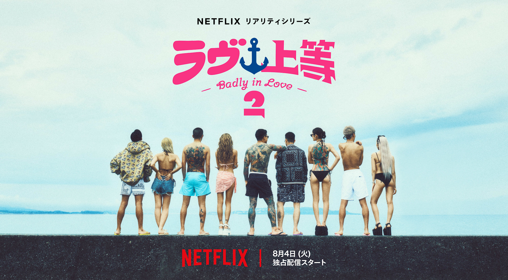
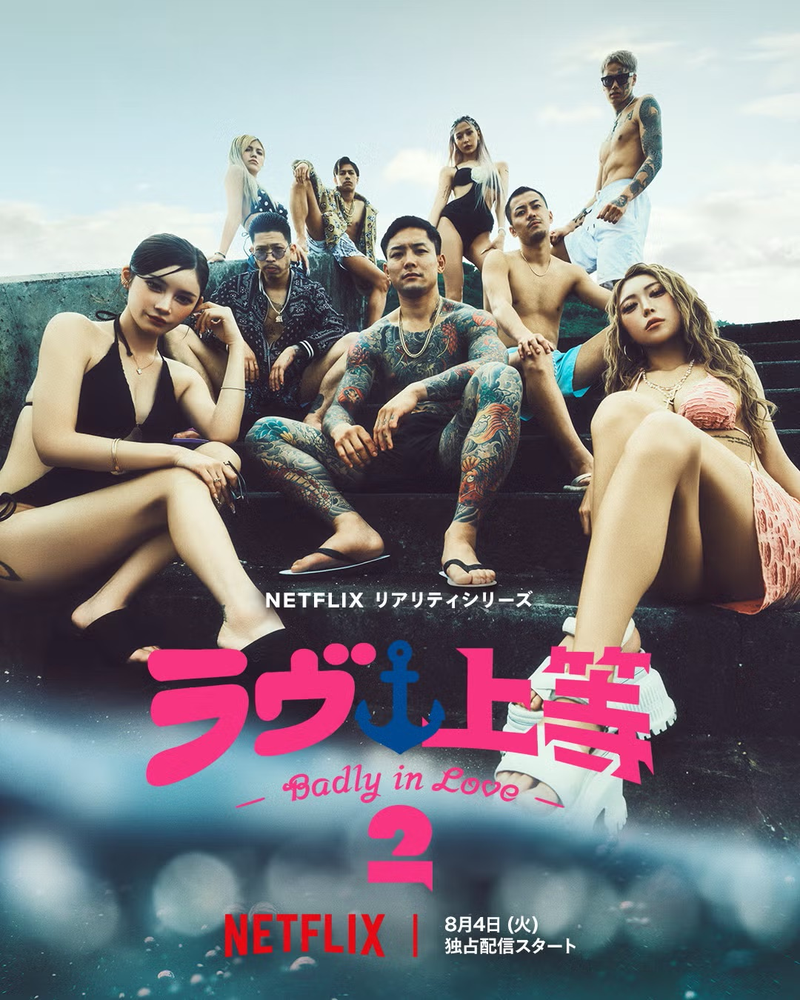
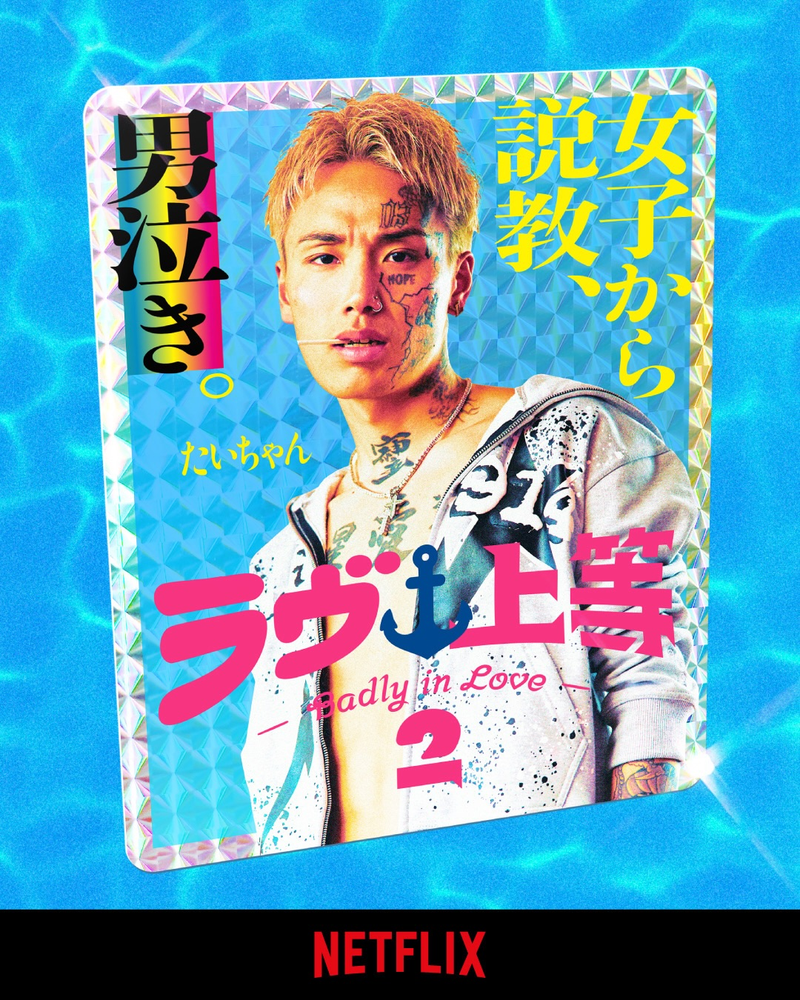
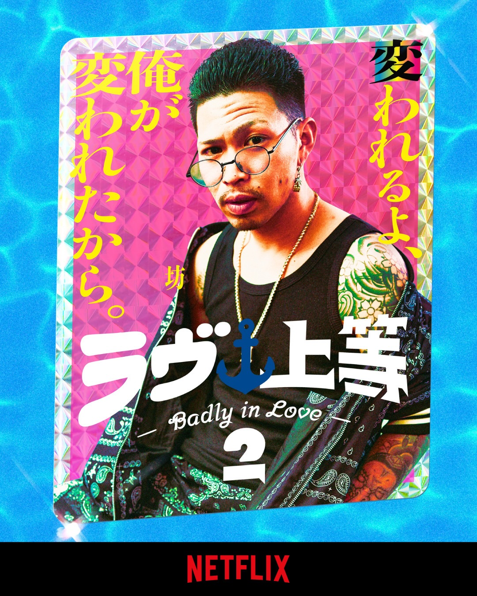
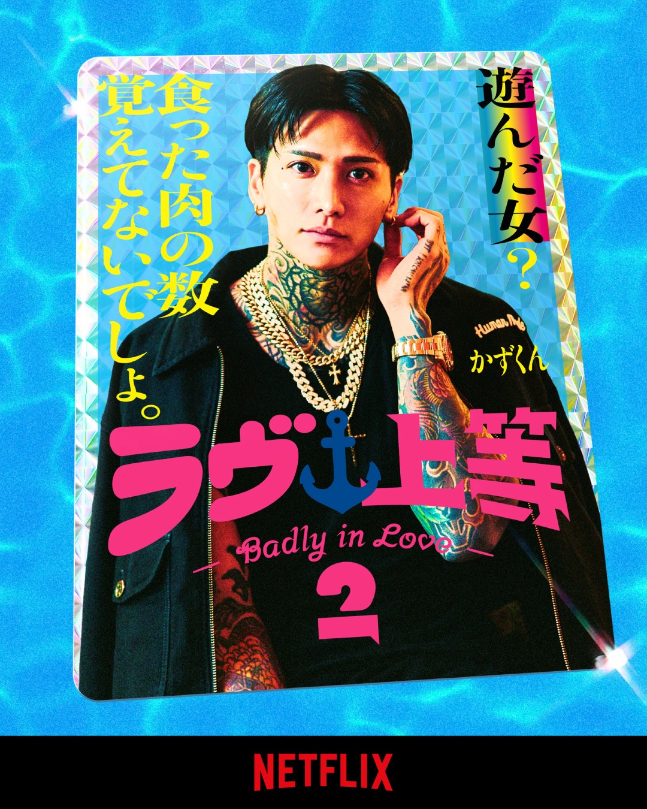
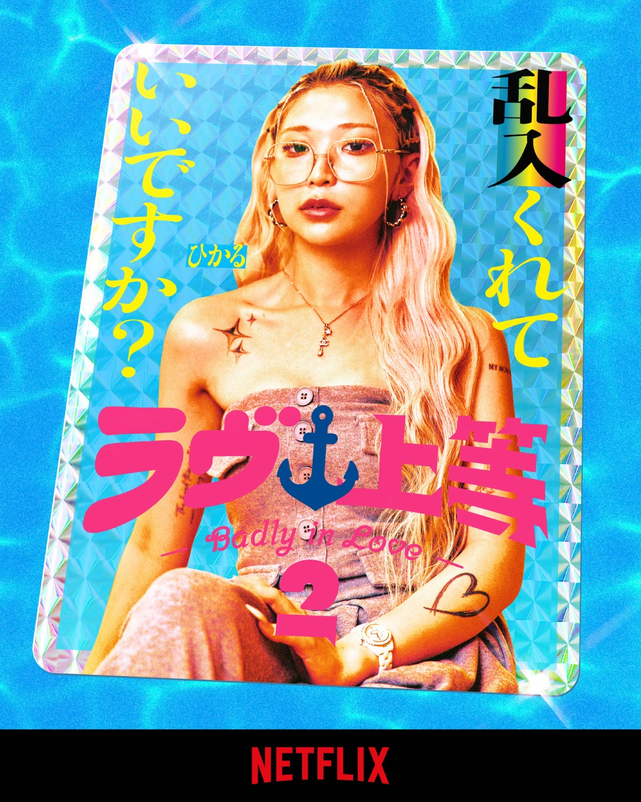

넷플릭스 연애 리얼리티 `불량 연애2`가 2026년 8월 공개를 시작했습니다. 일본어 제목은 `ラヴ上等`이며, 영어권에서는 `Badly in Love Season 2`로 표기됩니다. 시즌2는 한 번에 전편이 공개되는 방식이 아니라, 3주에 걸쳐 나뉘어 공개되는 분할 공개 형식입니다.

현재 2026년 8월 7일 기준으로는 VOL1에 해당하는 1화부터 4화까지 공개된 상태입니다. 남은 회차는 8월 11일과 8월 18일에 순차적으로 공개될 예정입니다.

이번 글에서는 `불량 연애2` 공개일과 회차 일정, 그리고 타이짱(Taichan), LEO, 아리(Ari), 보(Bo), 마군(Magun), 카즈군(Kazugun), 앗슨(Atsson), 히카루(Hikaru), 마리린(Marilyn), 루루(Ruru), 하짱(Hachan)까지 출연진 11명의 나이와 직업을 함께 정리했습니다.

## 불량 연애2 공개일

`불량 연애2`는 총 10부작으로 제작됐으며, VOL1, VOL2, VOL3로 나뉘어 공개됩니다. 공개 일정은 아래와 같습니다.

| 구분 | 공개일 | 공개 회차 | 현재 상태 |
|---|---:|---:|---|
| VOL1 | 2026년 8월 4일 | 1~4화 | 공개 완료 |
| VOL2 | 2026년 8월 11일 | 5~7화 | 공개 예정 |
| VOL3 | 2026년 8월 18일 | 8~10화 | 최종 공개 예정 |

총 10부작이므로 마지막 공개 회차는 8화, 9화, 10화입니다. 공개 일정을 찾을 때 19화처럼 잘못 표기된 정보를 볼 수 있는데, 시즌2 전체 회차 기준으로는 10화가 마지막 회차입니다.

## VOL1: 1~4화 공개 완료

VOL1은 2026년 8월 4일에 공개됐습니다. 1화부터 4화까지 볼 수 있으며, 첫 만남과 출연진들의 자기소개, 초반 분위기, 초기 러브라인을 확인할 수 있는 구간입니다.

분할 공개 작품은 초반 회차에서 출연진의 첫인상과 관계 구도가 빠르게 잡히는 편입니다. `불량 연애2` 역시 VOL1을 보면 누가 누구에게 관심을 보이는지, 어떤 성격의 출연자가 분위기를 주도하는지 대략적인 흐름을 파악할 수 있습니다.

## VOL2: 5~7화 공개 예정

VOL2는 2026년 8월 11일 공개 예정입니다. 공개 회차는 5화, 6화, 7화입니다.

1~4화에서 형성된 관계가 그대로 이어질지, 아니면 새로운 갈등이나 반전이 생길지가 관전 포인트입니다. 연애 리얼리티 특성상 중반부는 첫인상보다 실제 대화와 선택이 더 중요해지는 구간이기 때문에, VOL2부터는 러브라인이 본격적으로 흔들릴 가능성이 큽니다.

## VOL3: 8~10화 최종 공개 예정

VOL3는 2026년 8월 18일 공개 예정입니다. 8화, 9화, 10화가 공개되며, 이때 시즌2의 최종 결말까지 확인할 수 있습니다.

마지막 10화까지 공개되면 최종 커플 여부와 출연진들의 선택이 정리됩니다. 스포일러를 피하고 싶다면 8월 18일 이후에는 SNS나 커뮤니티 검색을 조심하는 편이 좋습니다.

> 넷플릭스 `불량 연애2`의 공개 시간은 한국 기준 오후 4시 전후로 알려져 있습니다. 다만 실제 노출 시간은 계정, 기기, 지역에 따라 약간 차이가 날 수 있으니 공개 당일에는 넷플릭스 앱을 새로고침해 확인하는 것이 좋습니다.

## 불량 연애2는 어떤 예능인가

`불량 연애2`는 강한 개성과 사연을 가진 남녀 출연진이 함께 생활하며 서로를 알아가는 연애 리얼리티입니다. 일반적인 데이팅 프로그램보다 출연진의 캐릭터와 첫인상이 강하게 드러나는 편이고, 관계가 만들어지는 과정에서 솔직한 대화와 감정 변화가 주요 볼거리로 작용합니다.

시즌2는 공개 전부터 출연진 구성과 분할 공개 방식 때문에 관심을 모았습니다. 특히 VOL1 공개 이후에는 출연진들의 첫인상, 직업, 나이, 러브라인에 대한 반응이 빠르게 이어지고 있습니다.

## 불량 연애2 출연진 나이·직업

현재 1~4화가 공개된 가운데, 출연진들의 강렬한 첫인상과 개성도 화제가 되고 있습니다. 시즌2는 오키나와의 `라부상등 마린 아카데미`를 배경으로, 남성 출연진과 여성 출연진이 공동생활을 하며 관계를 만들어가는 구도입니다.

아래부터는 공개된 프로필 기준으로 출연자별 나이, 직업, 출신 및 특징을 정리했습니다.

| 출연자 | 일본어/영어 표기 | 본명 | 나이 | 직업 | 비고 |
|---|---|---|---:|---|---|
| 타이짱 | タイちゃん / Taichan | 타이세이 | 22세 | 미용사 | 히로시마현 출신, 도쿄 거주 |
| LEO | レオ / LEO | 야마모토 레오 | 25세 | 바 운영 | 교토 거주 |
| 아리 | アリ / Ari | 콘도 아리 | 29세 | 래퍼, 모델 | 일본 자위대 출신 |
| 보 | ボー / Bo | 노구치 미즈키 | 27세 | 페인트공 | 후쿠오카 구루메 거주 |
| 마군 | マー君 / Magun | 오다 마사야 | 28세 | 격투기 선수 | 군마현 출신 |
| 카즈군 | カズ君 / Kazugun | 시오다 카즈마 | 29세 | 호스트 클럽 운영 | 중도 합류 |
| 앗슨 | あっすん / Atsson | 오구리 아스카 | 30세 | 회사 경영, 호스티스 | 여성 출연진 최연장 |
| 히카루 | ヒカル / Hikaru | 히카루 | 23세 | 호스티스 | 여성 출연자 |
| 마리린 | マリリン / Marilyn | 타카오카 마리나 | 25세 | 바 근무 | 여성 출연자 |
| 루루 | ルル / Ruru | 타나카 루루 | 26세 | 모델 | 시즈오카현 출신, 도쿄 거주 |
| 하짱 | はーちゃん / Hachan | 아베 하즈키 | 27세 | 킥복싱 트레이너 | 중도 합류 |

## 타이짱

- 일본어/영어 표기: タイちゃん / Taichan
- 본명: 타이세이
- 나이: 22세
- 직업: 미용사
- 출신: 히로시마현
- 거주지: 도쿄

타이짱은 `불량 연애2` 남성 출연진 중 가장 어린 출연자입니다. 미용사로 활동하고 있으며, 강렬한 외모와 자신감 있는 태도로 첫 등장부터 시선을 끌었습니다.

## LEO

- 일본어/영어 표기: レオ / LEO
- 본명: 야마모토 레오
- 나이: 25세
- 직업: 바 운영
- 거주지: 교토

LEO는 교토에서 바를 운영하고 있는 출연자입니다. 자신감 넘치는 모습과 거침없는 말투가 특징이며, 진한 어른의 연애를 해보고 싶다는 포부를 밝혔습니다.

## 아리

- 일본어/영어 표기: アリ / Ari
- 본명: 콘도 아리
- 나이: 29세
- 직업: 래퍼, 모델
- 과거 이력: 일본 자위대 출신으로 소개됨

아리는 래퍼와 모델로 활동하고 있는 출연자입니다. 개성 있는 스타일과 차분한 분위기를 가진 인물로, 남성 출연진 중에서도 독특한 캐릭터를 보여줄 것으로 기대됩니다.

## 보

- 일본어/영어 표기: ボー / Bo
- 본명: 노구치 미즈키
- 나이: 27세
- 직업: 페인트공
- 거주지: 후쿠오카 구루메

보는 후쿠오카 구루메에서 페인트공으로 일하고 있습니다. 자기소개 과정에서 강한 연애 경험을 언급해 다른 출연자들의 관심을 받았으며, 첫 만남부터 강렬한 인상을 남겼습니다.

## 마군

- 일본어/영어 표기: マー君 / Magun
- 본명: 오다 마사야
- 나이: 28세
- 직업: 격투기 선수
- 출신: 군마현

마군은 격투기 선수로 활동하고 있는 출연자입니다. 거친 외모와 강한 분위기를 풍기지만, 연애에 대해서는 의외로 조심스러운 모습을 보여주는 인물입니다.

## 카즈군

- 일본어/영어 표기: カズ君 / Kazugun
- 본명: 시오다 카즈마
- 나이: 29세
- 직업: 호스트 클럽 운영
- 특징: 중도 합류 출연자

카즈군은 다른 출연자들보다 늦게 등장하는 `메기남` 포지션의 인물입니다. 호스트 클럽을 운영하고 있으며, 새로운 러브라인을 만들어낼 수 있을지 관심을 모으고 있습니다.

## 앗슨

- 일본어/영어 표기: あっすん / Atsson
- 본명: 오구리 아스카
- 나이: 30세
- 직업: 회사 경영, 호스티스

앗슨은 회사 경영과 호스티스 일을 함께하고 있는 출연자입니다. 여성 출연진 중 가장 나이가 많으며, 당당하고 주도적인 분위기가 특징입니다.

## 히카루

- 일본어/영어 표기: ヒカル / Hikaru
- 이름: 히카루
- 나이: 23세
- 직업: 호스티스

히카루는 호스티스로 일하고 있는 출연자입니다. 밝고 화려한 분위기를 가진 인물로, 남성 출연자들과 어떤 관계를 만들어갈지 주목됩니다.

## 마리린

- 일본어/영어 표기: マリリン / Marilyn
- 본명: 타카오카 마리나
- 나이: 25세
- 직업: 바 근무

마리린은 바에서 일하고 있는 출연자입니다. 차분하면서도 개성 있는 매력을 가진 인물로 소개됐으며, 공동생활 속에서 어떤 모습을 보여줄지 기대를 모으고 있습니다.

## 루루

- 일본어/영어 표기: ルル / Ruru
- 본명: 타나카 루루
- 나이: 26세
- 직업: 모델
- 출신: 시즈오카현
- 거주지: 도쿄

루루는 모델로 활동하고 있습니다. 출연진 가운데 비교적 세련된 이미지가 강한 인물이며, 첫인상부터 여러 남성 출연자의 관심을 받을 가능성이 높은 출연자입니다.

## 하짱

- 일본어/영어 표기: はーちゃん / Hachan
- 본명: 아베 하즈키
- 나이: 27세
- 직업: 킥복싱 트레이너
- 특징: 중도 합류 출연자

하짱은 27세의 킥복싱 트레이너로 소개된 여성 출연자입니다. 중도 합류하는 인물인 만큼, 기존에 형성된 관계 구도에 어떤 변화를 만들지가 관전 포인트입니다.

## 언제 몰아보는 게 좋을까

결말까지 한 번에 보고 싶다면 2026년 8월 18일 이후에 보는 것이 가장 좋습니다. 이때 VOL3까지 모두 공개되기 때문에 1화부터 10화까지 끊김 없이 볼 수 있습니다.

반대로 매주 공개되는 흐름을 따라가며 출연진 반응과 커뮤니티 해석을 함께 보고 싶다면 지금부터 VOL1을 먼저 보고, 8월 11일 VOL2, 8월 18일 VOL3를 순서대로 따라가면 됩니다.

## 정리

`불량 연애2`는 총 10부작이며, 2026년 8월 4일부터 8월 18일까지 3주에 걸쳐 공개됩니다.

- 2026년 8월 4일: 1~4화 공개
- 2026년 8월 11일: 5~7화 공개 예정
- 2026년 8월 18일: 8~10화 최종 공개 예정

현재는 VOL1까지만 공개된 상태라 초반 러브라인과 출연진의 첫인상을 확인할 수 있습니다. 최종 선택과 결말까지 확인하려면 8월 18일 공개되는 VOL3까지 기다려야 합니다.
