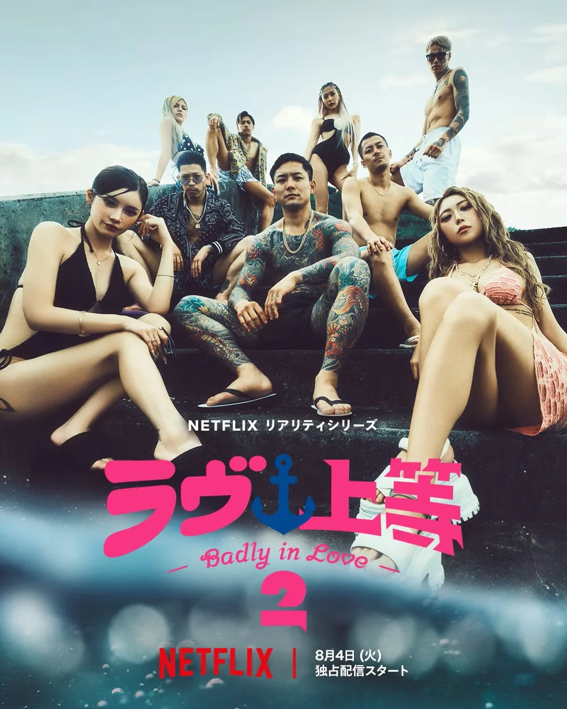
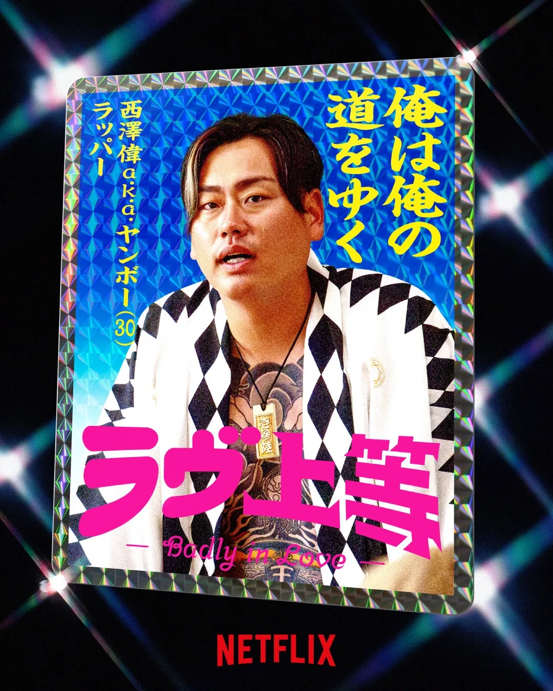
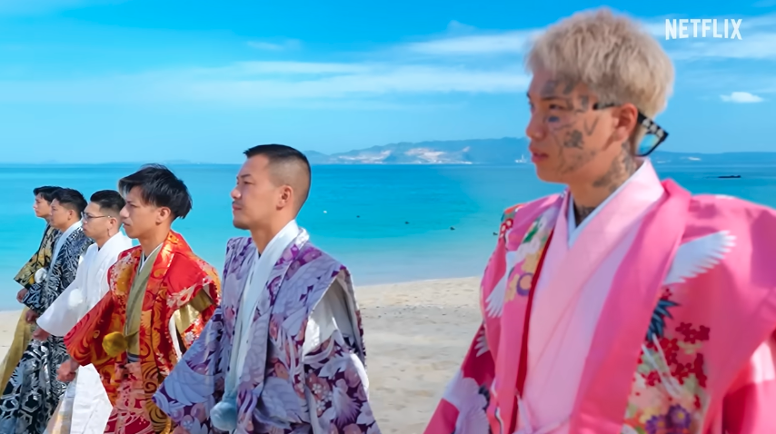
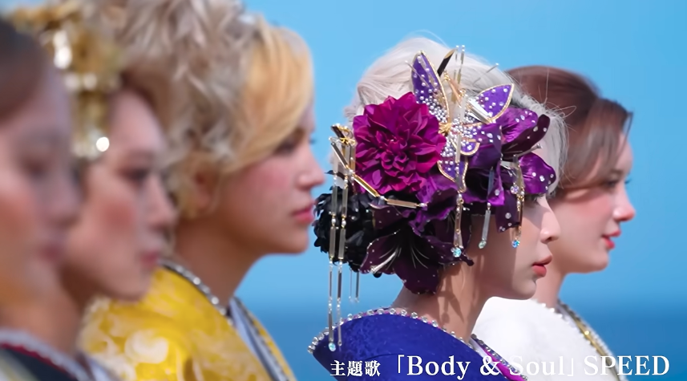

`불량 연애2` 7화 마지막에는 출연진 중 누군가가 교칙을 위반했다는 안내가 나오며 끝납니다. 2026년 8월 13일 기준으로 위반자는 공개되지 않았지만, 자막에 나온 교칙을 기준으로 보면 가장 먼저 봐야 할 가능성은 `미리 고백 금지`, `시간 엄수`, `성관계 금지` 쪽입니다.

현재 확인할 수 있는 것은 `VOL2` 마지막인 7화 엔딩에서 교칙위반 예고가 나왔다는 점입니다. 구체적인 위반 내용과 퇴학 여부는 `VOL3` 첫 회차인 8화 시작부에서 바로 이어질 내용으로 보입니다.

## 불량 연애2 교칙위반 핵심 정리

| 구분 | 내용 |
|---|---|
| 나온 시점 | VOL2 마지막, 7화 엔딩 |
| 확인된 내용 | 출연진 중 누군가의 교칙위반 안내 |
| 교칙 조건 | 시간 엄수, 약물 금지, 절도 금지, 폭력 금지, 미리 고백 금지, 성관계 금지 |
| 아직 미공개 | 위반자, 위반 항목, 퇴학 여부 |
| 관련 검색어 | 교칙위반, 규칙위반, 퇴학, 7화, VOL2 |
| 다음 확인 지점 | VOL3 8~10화 |

정리하면 지금 단계에서는 특정 출연자를 범인처럼 단정하기보다, 어떤 교칙이 현재 스토리와 가장 잘 맞는지 나눠 보는 것이 더 정확합니다. 방송은 위반자를 바로 공개하지 않고 다음 공개분의 궁금증으로 넘긴 상태입니다.

## 7화 마지막에 나온 교칙위반 예고

`불량 연애2`는 VOL1, VOL2, VOL3로 나뉘어 공개됩니다. 2026년 8월 11일 공개된 VOL2는 5화부터 7화까지이며, 7화 마지막 장면에서 교칙위반 안내가 나오면서 분위기가 크게 바뀝니다.

이 장면은 단순한 예고 자막이라기보다, 다음 회차에서 출연진 관계와 생활 규칙이 함께 흔들릴 수 있다는 신호로 볼 수 있습니다. 연애 리얼리티에서 규칙 위반은 개인의 선택뿐 아니라 다른 출연자들의 신뢰와 러브라인에도 영향을 주기 때문입니다.

## 불량 연애2 교칙위반 조건

7화 자막에서 확인되는 교칙 조건은 아래 6가지입니다.

| 교칙 | 의미 |
|---|---|
| 시간 엄수 | 정해진 시간과 일정 규칙을 지키는 것 |
| 약물 금지 | 금지된 약물 사용을 하지 않는 것 |
| 절도 금지 | 다른 사람의 물건을 훔치지 않는 것 |
| 폭력 금지 | 몸싸움, 폭행 등 폭력 행동을 하지 않는 것 |
| 미리 고백 금지 | 정해진 시점 전 고백을 하지 않는 것 |
| 성관계 금지 | 공동생활 중 성관계를 하지 않는 것 |

따라서 7화 마지막의 교칙위반은 이 여섯 가지 중 하나와 관련됐을 가능성이 큽니다.

## 현재 스토리 기준으로 가능성이 큰 교칙은?

검색 가능한 공개 웹 기준으로는 7화 교칙위반자를 특정하는 신뢰할 만한 커뮤니티 정리글은 아직 확인되지 않았습니다. 그래서 현재는 커뮤니티 단정보다 방송 흐름과 7화 자막의 교칙 조건을 나눠 보는 편이 안전합니다.

| 교칙 | 현재까지의 가능성 | 봐야 할 장면 |
|---|---|---|
| 미리 고백 금지 | 가장 현실적인 추측 축. 특히 앗슨·마군 라인을 먼저 볼 만함 | 도시락 장면의 의미, 사적인 대화, 직접 고백에 가까운 말 |
| 시간 엄수 | 생활 규칙 위반 가능성 | 일정 이탈, 무단 이동, 늦은 귀가 |
| 성관계 금지 | 파급력이 큰 규칙 | 밤 시간대 동선, 둘만의 공간, 제작진 호출 |
| 폭력 금지 | 갈등이 격해졌을 때 가능 | 말다툼이 몸싸움으로 번졌는지 |
| 절도 금지 | 현재 방송 흐름상 근거 약함 | 물건 분실, 제작진의 강한 문제 제기 |
| 약물 금지 | 현재 방송 흐름상 근거 약함 | 별도 조사나 건강 이상 장면 |

스토리 흐름만 놓고 보면 가장 먼저 볼 항목은 `미리 고백 금지`입니다. 이 경우 현재까지 가장 가능성 있게 거론할 수 있는 라인은 앗슨과 마군입니다. VOL2에서는 마리린을 둘러싼 남성 출연진들의 태도를 두고 남자 진영과 여자 진영의 갈등이 커졌고, 그 과정에서 앗슨이 그만하고 가고 싶다는 식의 말을 하는 장면도 나왔습니다.

이 흐름 때문에 7화에서 앗슨이 마군에게 손수 도시락을 건넨 장면은 두 가지로 읽힙니다. 하나는 마군을 향한 고백에 가까운 표현이었을 가능성이고, 다른 하나는 앗슨이 떠나고 싶은 마음을 드러낸 뒤 마지막 인사처럼 도시락을 준비한 것 아니냐는 해석입니다. 어느 쪽이든 `미리 고백 금지`라는 교칙과 맞물려 VOL3에서 다시 확인해야 할 장면입니다.

두 번째는 `시간 엄수`입니다. 공동생활 예능에서 시간 규칙은 제작진이 가장 쉽게 확인할 수 있는 위반 항목입니다. 무단 이탈, 늦은 귀가, 정해진 장소 밖에서의 만남이 있었다면 7화 엔딩의 교칙위반 예고와 연결될 수 있습니다.

`성관계 금지`는 실제로 걸렸다면 파급력이 가장 큰 항목입니다. 다만 현재 공개분만으로 특정 출연자나 특정 장면을 연결하기에는 근거가 부족합니다. `절도 금지`와 `약물 금지`도 페널티 수위는 클 수 있지만, 지금까지의 방송 흐름에서는 뚜렷한 단서가 약한 편입니다.

## 퇴학 가능성이 언급되는 이유

검색어에 `불량연애2 퇴학`이 함께 뜨는 이유는 교칙위반이라는 표현이 프로그램의 학교 콘셉트와 연결되기 때문입니다. `불량 연애2`는 출연진이 공동생활을 하며 정해진 규칙 안에서 관계를 만들어가는 형식이라, 규칙을 어기면 단순 경고가 아니라 더 큰 페널티가 있을 수 있다는 추측이 자연스럽게 나옵니다.

다만 실제로 퇴학 조치가 내려지는지는 아직 확정되지 않았습니다. 방송에서 확인된 것은 7화 마지막의 규칙위반 안내까지이며, 퇴학 여부는 VOL3 공개 후 확인해야 합니다.

시즌1 사례를 보면 교칙위반이나 트러블이 모두 곧바로 퇴학으로 이어진 것은 아니었습니다. 실제로 조기 퇴학을 당한 출연자는 얀보였고, 베이비는 아모와의 갈등 과정에서 과격한 행동으로 퇴학 위기처럼 언급됐지만 최종적으로는 퇴학까지 가지 않았습니다.

<a href="/posts/불량-연애-시즌1-출연진-결말-총정리/" style="display:grid;grid-template-columns:minmax(0,1fr) 150px;gap:12px;align-items:center;overflow:hidden;border:1px solid #3b82f6;border-radius:8px;background:#111827;padding:10px 12px;margin:16px 0;color:#f9fafb;text-decoration:none;">
  
    <strong style="display:block;color:#60a5fa;line-height:1.35;font-size:1rem;text-decoration:underline;">불량 연애 시즌1 출연진·결말 총정리｜시즌2 보기 전 복습</strong>
  
  
</a>

| 시즌1 사례 | 당시 상황 | 결과 |
|---|---|---|
| 얀보 | 약물 복용 관련 규정 위반, 불량한 태도 | 경고 없이 즉각 퇴학 |
| 베이비 | 아모와의 갈등 중 물벼락 등 과격한 행동 | 갈등 해결 후 실제 퇴학은 아님 |

  <figure style="margin:0;">
    
    <figcaption style="font-size:0.9em;color:#666;margin-top:6px;">시즌1 실제 퇴학 사례로 언급되는 얀보</figcaption>
  </figure>
  <figure style="margin:0;">
    
    <figcaption style="font-size:0.9em;color:#666;margin-top:6px;">트러블은 있었지만 퇴학까지 이어지지 않은 베이비</figcaption>
  </figure>

이 전례를 놓고 보면 시즌2의 7화 교칙위반도 실제 퇴학까지 갈 수도 있지만, 경고나 분위기 환기 선에서 마무리될 가능성도 충분히 있습니다. 특히 위반 항목이 `시간 엄수`나 `미리 고백 금지`처럼 관계 흐름과 연결된 규칙이라면, 즉각 퇴학보다는 경고 또는 페널티로 처리될 가능성도 함께 봐야 합니다.

| 가능성 | 현재 상태 |
|---|---|
| 경고로 끝남 | 가능성 있음, 시즌1 베이비 사례처럼 실제 퇴학까지 가지 않을 수 있음 |
| 데이트·선택권 제한 | 가능성 있음, 아직 미공개 |
| 퇴학 또는 중도 하차 | 가능성 있음, 시즌1 얀보 사례처럼 중대한 위반이면 가능 |
| 단순 예고성 편집 | 가능성 큼, 트레일러 최종선택 장면과 함께 확인 필요 |

## 제작진의 낚시 편집일 가능성

한편 교칙위반 예고가 실제 퇴학으로 이어지지 않고, 제작진의 낚시 편집일 것이라는 추측도 있습니다. 근거는 최초 트레일러에 나온 최종선택 장면입니다. 트레일러 기준으로는 남자 출연자와 여자 출연자가 모두 최종선택 장소에 서 있는 것처럼 보이기 때문입니다.



만약 교칙위반이 곧바로 퇴학이나 중도 하차로 이어졌다면, 최종선택 장면에서 특정 출연자가 빠져 있어야 자연스럽습니다. 그런데 트레일러에서는 남녀 출연진이 모두 보이는 구도가 잡혔기 때문에, 7화 엔딩의 교칙위반 안내는 실제 탈락보다는 긴장감을 키우기 위한 예고성 편집일 가능성도 있습니다.

다만 트레일러 장면은 편집 순서와 실제 본편 흐름이 다를 수 있습니다. 따라서 이 장면은 “퇴학이 아닐 수도 있다”는 근거로는 볼 수 있지만, 교칙위반 자체가 없었다고 결론 내릴 수 있는 증거는 아닙니다.

## 왜 카즈군, 마군, 앗슨 이름이 같이 검색될까

자동완성에는 `불량연애2 카즈군`, `불량연애2 마군`, `불량연애2 앗슨` 같은 키워드도 함께 보입니다. 이는 교칙위반자가 이들 중 한 명으로 확정됐다는 뜻은 아닙니다.

카즈군은 중도 합류 이후 관계 구도에 변화를 만든 인물입니다. 특히 루루와의 접점이 늘면서 기존 흐름을 흔드는 포지션이 됐기 때문에, 시청자 입장에서는 `미리 고백 금지`나 사적인 접촉 가능성을 함께 떠올리기 쉽습니다.

마군과 앗슨은 초반부터 온도 차가 눈에 띄는 러브라인으로 언급됐습니다. 여기에 마리린을 둘러싼 갈등, 앗슨의 이탈 의사, 마군에게 건넨 도시락 장면이 이어지면서 `미리 고백 금지`와 연결해 보는 추측이 가장 자연스러운 흐름이 됐습니다. 핵심은 도시락 자체보다 그 전후 대화와 분위기가 고백에 가까웠는지, 혹은 작별 인사에 가까웠는지입니다.

히카루 쪽도 완전히 빼고 보기는 어렵습니다. 타이짱, 아리, 보와 얽힌 삼각 구도가 있었기 때문에, 만약 교칙위반이 `미리 고백 금지`라면 이 라인에서 어떤 말이 오갔는지도 다시 보게 됩니다. 다만 이 역시 현재는 가능성의 축일 뿐, 특정 출연자가 위반했다고 확정할 수 있는 단계는 아닙니다.

출연진의 나이, 직업, 기본 프로필과 인스타 정보는 아래 글에서 따로 정리했습니다.

<a href="/posts/불량-연애2-공개일-출연진-총정리/" style="display:grid;grid-template-columns:minmax(0,1fr) 150px;gap:12px;align-items:center;overflow:hidden;border:1px solid #3b82f6;border-radius:8px;background:#111827;padding:10px 12px;margin:16px 0;color:#f9fafb;text-decoration:none;">
  
    <strong style="display:block;color:#60a5fa;line-height:1.35;font-size:1rem;text-decoration:underline;">불량 연애2 공개일·출연진 나이 직업 총정리｜VOL1·VOL2·VOL3 일정</strong>
  
  
</a>

<a href="/posts/불량-연애2-출연진-인스타-주소-총정리/" style="display:grid;grid-template-columns:minmax(0,1fr) 150px;gap:12px;align-items:center;overflow:hidden;border:1px solid #3b82f6;border-radius:8px;background:#111827;padding:10px 12px;margin:16px 0;color:#f9fafb;text-decoration:none;">
  
    <strong style="display:block;color:#60a5fa;line-height:1.35;font-size:1rem;text-decoration:underline;">불량 연애2 출연진 인스타 주소 총정리｜1위는 누구? 앗슨·카즈군·루루·타이짱 순위</strong>
  
  
</a>

## VOL3에서 확인해야 할 포인트

VOL3에서는 세 가지를 확인하면 됩니다.

| 확인 포인트 | 봐야 하는 이유 |
|---|---|
| 누가 교칙을 위반했는가 | 7화 엔딩의 핵심 미공개 정보 |
| 6가지 중 어떤 규칙을 어겼는가 | 단순 지각인지, 관계를 흔드는 행동인지 판단 가능 |
| 퇴학으로 이어지는가 | 시즌 후반 러브라인과 최종 선택에 직접 영향 |

교칙위반이 실제 퇴학으로 이어진다면, 남은 회차의 러브라인은 크게 흔들릴 수 있습니다. 반대로 경고나 페널티 정도로 끝난다면, 특정 출연자의 이미지와 관계 변화가 더 중요한 포인트가 될 수 있습니다.

## 불량 연애2 VOL3 공개일

`불량 연애2` VOL3는 2026년 8월 18일 공개 예정입니다. 마지막 공개분에는 8화, 9화, 10화가 포함되며, 7화 엔딩의 교칙위반 예고는 8화 시작부에서 바로 이어질 내용입니다.

공개 일정 전체는 아래와 같습니다.

| 구분 | 공개일 | 회차 |
|---|---:|---:|
| VOL1 | 2026년 8월 4일 | 1~4화 |
| VOL2 | 2026년 8월 11일 | 5~7화 |
| VOL3 | 2026년 8월 18일 | 8~10화 |

## FAQ

### 불량 연애2 교칙위반자는 누구인가요?

2026년 8월 13일 기준으로 아직 공개되지 않았습니다. 7화 마지막에는 교칙위반 안내만 나왔고, 위반자가 누구인지는 VOL3 8화 시작부에서 바로 확인될 내용으로 보입니다.

### 불량 연애2 교칙위반은 몇 화에 나오나요?

교칙위반 안내는 VOL2 마지막인 7화 엔딩에서 나옵니다.

### 불량 연애2 교칙위반 조건은 무엇인가요?

7화 자막 기준으로 시간 엄수, 약물 금지, 절도 금지, 폭력 금지, 미리 고백 금지, 성관계 금지입니다.

### 불량 연애2 교칙위반하면 퇴학인가요?

아직 확정되지 않았습니다. 퇴학 가능성이 검색되고 있지만, 실제 페널티가 퇴학인지 경고인지 방송에서 공개된 상태는 아닙니다.

### 불량 연애2 VOL3는 언제 공개되나요?

VOL3는 2026년 8월 18일 공개 예정이며, 8화부터 10화까지가 포함됩니다.

### 불량 연애2 다시보기는 어디서 하나요?

`불량 연애2`는 넷플릭스에서 다시보기할 수 있습니다. 공개 회차와 출연진 정보는 [불량 연애2 공개일·출연진 나이 직업 총정리](/posts/불량-연애2-공개일-출연진-총정리/)에서 함께 정리했습니다.

## 관련 글

  <strong style="display:block;color:#f9fafb;margin-bottom:12px;">관련해서 바로 보기</strong>
  

    <a href="/posts/불량-연애2-공개일-출연진-총정리/" style="display:block;color:#f9fafb;text-decoration:none;">
      
      <strong style="display:block;color:#f9fafb;margin-top:8px;line-height:1.35;">출연진 총정리</strong>
    </a>
    <a href="/posts/불량-연애2-ep4-러브라인-호감도-관계도/" style="display:block;color:#f9fafb;text-decoration:none;">
      
      <strong style="display:block;color:#f9fafb;margin-top:8px;line-height:1.35;">EP4 러브라인 정리</strong>
    </a>
    <a href="/posts/불량-연애2-출연진-인스타-주소-총정리/" style="display:block;color:#f9fafb;text-decoration:none;">
      
      <strong style="display:block;color:#f9fafb;margin-top:8px;line-height:1.35;">인스타 총정리</strong>
    </a>
  

