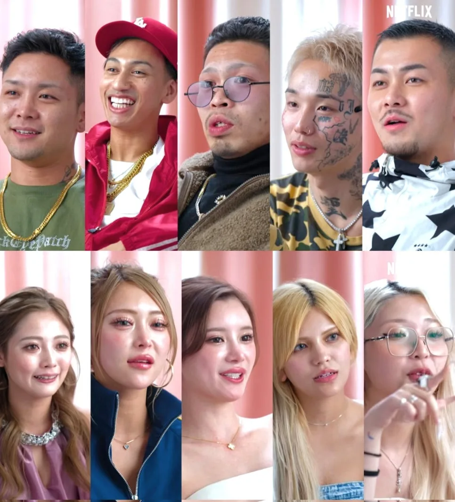

`불량 연애2` 출연진 인스타 주소는 타이짱, LEO, 아리, 보, 마군, 카즈군, 앗슨, 히카루, 마리린, 루루, 하짱까지 총 11명 기준으로 확인할 수 있습니다. 아래 표는 2026년 8월 13일 나무위키 `불량 연애 시즌2` 문서에 정리된 Instagram 링크를 기준으로 다시 정리한 내용입니다.

SNS 계정은 방송 이후 아이디가 바뀌거나 비공개로 전환될 수 있습니다. 팔로우하기 전에는 프로필 사진, 게시물, 출연 관련 언급을 함께 확인하는 편이 좋습니다.

## 불량 연애2 출연진 인스타 한눈에 보기

| 출연자 | 일본어/영어 표기 | 인스타 주소 | 팔로워 수 |
|---|---|---|---|
| 카즈군 | カズ君 / Kazugun | [@kazumasks](https://www.instagram.com/kazumasks) | 68K |
| LEO | レオ / LEO | [@y_1leoyade](https://www.instagram.com/y_1leoyade) | 7,248 |
| 보 | ボー / Bo | [@p.19.g.98](https://www.instagram.com/p.19.g.98) | 3,298 |
| 아리 | アリ / Ari | [@ari999__](https://www.instagram.com/ari999__) | 18K |
| 타이짱 | タイちゃん / Taichan | [@taisei_15_31](https://www.instagram.com/taisei_15_31) | 49K |
| 마군 | マー君 / Magun | [@zzz.odmsy](https://www.instagram.com/zzz.odmsy) | 34K |
| 루루 | ルル / Ruru | [@u_r30](https://www.instagram.com/u_r30) | 64K |
| 앗슨 | あっすん / Atsson | [@_assunsun_](https://www.instagram.com/_assunsun_) | 429K |
| 마리린 | マリリン / Marilyn | [@maririn__dayo__](https://www.instagram.com/maririn__dayo__) | 16K |
| 히카루 | ヒカル / Hikaru | [@______hhh912](https://www.instagram.com/______hhh912) | 19K |
| 하짱 | はーちゃん / Hachan | [@hazuki_19980726](https://www.instagram.com/hazuki_19980726) | 3,795 |

※ 팔로워 수는 2026년 8월 13일 Instagram 공개 프로필 메타 기준입니다. 출연진의 나이, 직업, 방송상 특징은 [불량 연애2 공개일·출연진 나이 직업 총정리](/posts/불량-연애2-공개일-출연진-총정리/)에서 따로 정리했습니다.

## 불량 연애2 남성 출연진 인스타 팔로워순 랭킹

  <a href="https://www.instagram.com/kazumasks" target="_blank" rel="noopener noreferrer" style="display:block;border:1px solid #e5e7eb;border-radius:8px;padding:12px;text-decoration:none;">
    
    <strong style="display:block;margin-top:8px;">1위 카즈군</strong>
    @kazumasks
    팔로워 68K
  </a>
  <a href="https://www.instagram.com/taisei_15_31" target="_blank" rel="noopener noreferrer" style="display:block;border:1px solid #e5e7eb;border-radius:8px;padding:12px;text-decoration:none;">
    
    <strong style="display:block;margin-top:8px;">2위 타이짱</strong>
    @taisei_15_31
    팔로워 49K
  </a>
  <a href="https://www.instagram.com/zzz.odmsy" target="_blank" rel="noopener noreferrer" style="display:block;border:1px solid #e5e7eb;border-radius:8px;padding:12px;text-decoration:none;">
    
    <strong style="display:block;margin-top:8px;">3위 마군</strong>
    @zzz.odmsy
    팔로워 34K
  </a>
  <a href="https://www.instagram.com/ari999__" target="_blank" rel="noopener noreferrer" style="display:block;border:1px solid #e5e7eb;border-radius:8px;padding:12px;text-decoration:none;">
    
    <strong style="display:block;margin-top:8px;">4위 아리</strong>
    @ari999__
    팔로워 18K
  </a>
  <a href="https://www.instagram.com/y_1leoyade" target="_blank" rel="noopener noreferrer" style="display:block;border:1px solid #e5e7eb;border-radius:8px;padding:12px;text-decoration:none;">
    
    <strong style="display:block;margin-top:8px;">5위 LEO</strong>
    @y_1leoyade
    팔로워 7,248
  </a>
  <a href="https://www.instagram.com/p.19.g.98" target="_blank" rel="noopener noreferrer" style="display:block;border:1px solid #e5e7eb;border-radius:8px;padding:12px;text-decoration:none;">
    
    <strong style="display:block;margin-top:8px;">6위 보</strong>
    @p.19.g.98
    팔로워 3,298
  </a>

남성 출연진만 보면 카즈군이 가장 앞서고, 타이짱과 마군이 그 뒤를 잇습니다.

## 불량 연애2 여성 출연진 인스타 팔로워순 랭킹

  <a href="https://www.instagram.com/_assunsun_" target="_blank" rel="noopener noreferrer" style="display:block;border:1px solid #e5e7eb;border-radius:8px;padding:12px;text-decoration:none;">
    
    <strong style="display:block;margin-top:8px;">1위 앗슨</strong>
    @_assunsun_
    팔로워 429K
  </a>
  <a href="https://www.instagram.com/u_r30" target="_blank" rel="noopener noreferrer" style="display:block;border:1px solid #e5e7eb;border-radius:8px;padding:12px;text-decoration:none;">
    
    <strong style="display:block;margin-top:8px;">2위 루루</strong>
    @u_r30
    팔로워 64K
  </a>
  <a href="https://www.instagram.com/______hhh912" target="_blank" rel="noopener noreferrer" style="display:block;border:1px solid #e5e7eb;border-radius:8px;padding:12px;text-decoration:none;">
    
    <strong style="display:block;margin-top:8px;">3위 히카루</strong>
    @______hhh912
    팔로워 19K
  </a>
  <a href="https://www.instagram.com/maririn__dayo__" target="_blank" rel="noopener noreferrer" style="display:block;border:1px solid #e5e7eb;border-radius:8px;padding:12px;text-decoration:none;">
    
    <strong style="display:block;margin-top:8px;">4위 마리린</strong>
    @maririn__dayo__
    팔로워 16K
  </a>
  <a href="https://www.instagram.com/hazuki_19980726" target="_blank" rel="noopener noreferrer" style="display:block;border:1px solid #e5e7eb;border-radius:8px;padding:12px;text-decoration:none;">
    
    <strong style="display:block;margin-top:8px;">5위 하짱</strong>
    @hazuki_19980726
    팔로워 3,795
  </a>

여성 출연진에서는 앗슨의 팔로워 수가 가장 높고, 루루가 두 번째입니다. 방송 공개 이후에는 출연자별 이슈와 러브라인에 따라 팔로워 수가 빠르게 바뀔 수 있습니다.

## 함께 보면 좋은 글

- [불량 연애2 공개일·출연진 나이 직업 총정리](/posts/불량-연애2-공개일-출연진-총정리/)
- [불량 연애2 EP4 러브라인 정리](/posts/불량-연애2-ep4-러브라인-호감도-관계도/)
- [불량 연애 시즌1 출연진·결말 총정리](/posts/불량-연애-시즌1-출연진-결말-총정리/)

## FAQ

### 불량 연애2 마리린 인스타는 무엇인가요?

마리린 인스타는 [@maririn__dayo__](https://www.instagram.com/maririn__dayo__)입니다.

### 불량 연애2 카즈군 인스타는 무엇인가요?

카즈군 인스타는 [@kazumasks](https://www.instagram.com/kazumasks)입니다.

### 불량 연애2 마군 인스타는 무엇인가요?

마군 인스타는 [@zzz.odmsy](https://www.instagram.com/zzz.odmsy)입니다.

### 불량 연애2 히카루 인스타는 무엇인가요?

히카루 인스타는 [@______hhh912](https://www.instagram.com/______hhh912)입니다.

### 불량 연애2 출연진 인스타는 바뀔 수 있나요?

네. Instagram 계정은 본인이 아이디를 바꾸거나 비공개로 전환할 수 있습니다. 이 글은 2026년 8월 13일 확인 기준입니다.

## 참고 자료

- [Netflix Japan 공식 Instagram](https://www.instagram.com/netflixjp)
