`불량 연애2` VOL3는 2026년 8월 18일 공개된 8화부터 10화까지의 마지막 공개분입니다. 7화 엔딩에서 예고된 교칙위반의 정체, 졸업식 최종 선택, 그리고 타이짱 유급으로 이어지는 시즌2 2기 예고까지 한 번에 나온 구간입니다.

이 글에는 `불량 연애2` VOL3와 최종 선택 결과 스포일러가 포함됩니다. 아직 8화부터 10화까지 보지 않았다면 아래 접힌 영역은 시청 후 확인하는 것이 좋습니다.

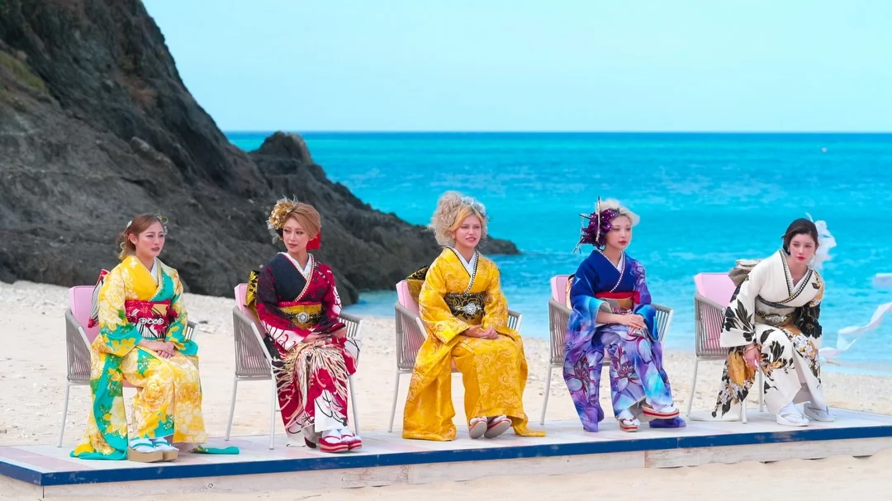

## 불량 연애2 VOL3 핵심 정리

| 구분 | 내용 |
|---|---|
| 공개일 | 2026년 8월 18일 |
| 포함 회차 | 8화, 9화, 10화 |
| 핵심 사건 | 앗슨 교칙위반, 정학, 졸업식 최종 선택 |
| 최종 성립 커플 | 마군·앗슨, 아리·히카루, 카즈군·루루 |
| 마지막 반전 | 타이짱 유급 제안 |
| 후속 공개 | 시즌2 2기, 11-20화 |

VOL3는 단순히 마지막 고백만 보여주는 구간이 아니었습니다. 7화 마지막에 던져진 교칙위반 예고가 실제 사건으로 이어졌고, 가장 가능성이 높아 보였던 마군·앗슨 라인도 졸업 직전까지 흔들렸습니다.

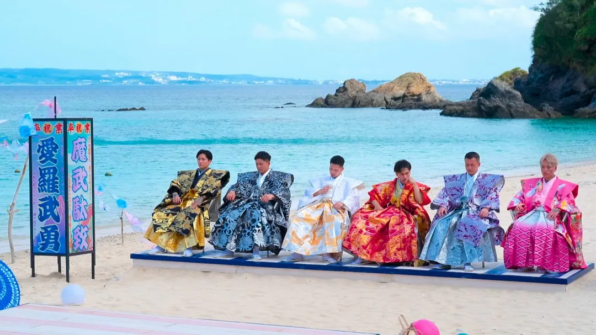

## 7화 교칙위반 주인공은 앗슨

7화 엔딩에서 예고된 교칙위반의 주인공은 앗슨이었습니다. 초반에 시청자들이 먼저 떠올릴 만한 규칙은 `미리 고백 금지`, `폭력 금지`, `성관계 금지`, `약물 금지` 같은 강한 항목이었지만, 실제 문제는 허용된 시간 외 음주였습니다.

앗슨은 음주가 정해진 때에만 허용되는 상황에서 술을 텀블러에 몰래 담아 마셨습니다. 더 큰 문제는 알코올 알러지가 있던 히카루가 그것을 모르고 마실 뻔했다는 점입니다. 단순히 술을 몰래 마신 장면이 아니라, 다른 출연자의 건강 문제로 이어질 수 있었던 사건이었습니다.

기존 7화 엔딩 예고와 교칙 조건은 아래 글에서 따로 정리했습니다.

<a href="/posts/불량-연애2-교칙위반-퇴학-7화-엔딩-정리/" style="display:grid;grid-template-columns:minmax(0,1fr) 150px;gap:12px;align-items:center;overflow:hidden;border:1px solid #3b82f6;border-radius:8px;background:#111827;padding:10px 12px;margin:16px 0;color:#f9fafb;text-decoration:none;">
  
    <strong style="display:block;color:#60a5fa;line-height:1.35;font-size:1rem;text-decoration:underline;">불량 연애2 교칙위반 누구?｜7화 엔딩 규칙위반·퇴학 예고 정리</strong>
  
  
</a>

## 앗슨은 왜 정학까지 갔나

앗슨의 교칙위반은 한 번의 실수로만 끝나지 않았습니다. 이후 다시 음주가 허락된 시간이 있었지만, 술을 마신 뒤 밤늦게 남자방에 들어가면서 다시 한 번 퇴학 위기에 놓였습니다.

결과적으로 즉시 퇴학은 아니었지만, 앗슨에게는 정학 처리가 내려졌습니다. 잠시 학교를 벗어났다가 돌아오는 흐름이었기 때문에, 시즌1 얀보처럼 완전한 중도 퇴학으로 끝난 사건은 아니었습니다. 다만 제작진이 안전 문제와 공동생활의 선을 분명하게 짚고 넘어간 사건으로 볼 수 있습니다.

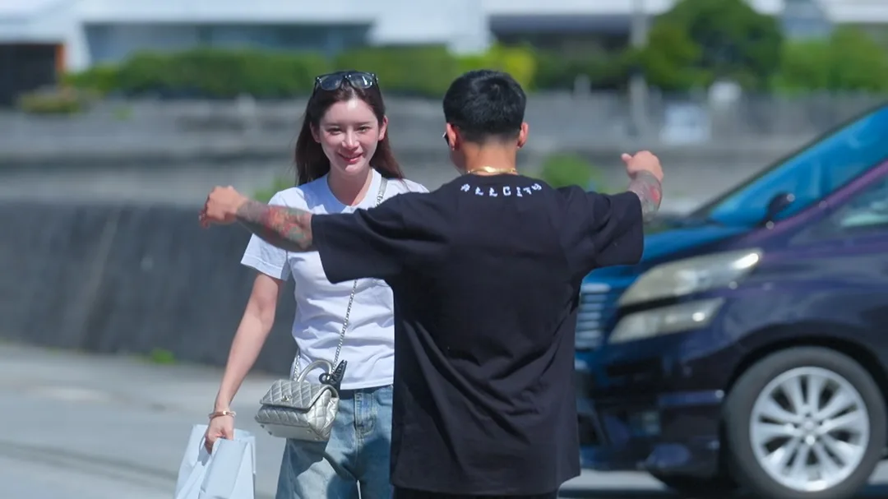

## 마군과 앗슨, 가장 유력했지만 가장 위태로웠던 커플

이 사건이 더 크게 보였던 이유는 마군과의 관계 때문입니다. 마군은 술에 대해 좋지 않은 기억이 있는 인물로 그려졌고, 앗슨의 몰래 음주와 반복된 음주 문제를 쉽게 넘기기 어려운 표정을 보였습니다.

초반부터 마군과 앗슨은 가장 가능성이 높은 커플처럼 보였습니다. 하지만 졸업식이 가까워질수록 오히려 관계는 위태롭게 흔들렸고, 최종 선택에서 마군이 앗슨을 그대로 선택할지도 VOL3의 중요한 긴장 포인트가 됐습니다.

결과적으로 두 사람은 서로를 선택하며 커플이 됐습니다. 다만 이 결과는 단순한 직진 서사라기보다, 마지막 위기를 지나 다시 확인한 관계에 가깝습니다.

<a href="/posts/불량연애2-마군-손가락-왜-없나-앗슨-음주-사건-과거/" style="display:grid;grid-template-columns:minmax(0,1fr) 150px;gap:12px;align-items:center;overflow:hidden;border:1px solid #3b82f6;border-radius:8px;background:#111827;padding:10px 12px;margin:16px 0;color:#f9fafb;text-decoration:none;">
  
    <strong style="display:block;color:#60a5fa;line-height:1.35;font-size:1rem;text-decoration:underline;">불량 연애2 마군 손가락 왜 없나｜앗슨 음주 사건 후 공개된 과거</strong>
  
  
</a>

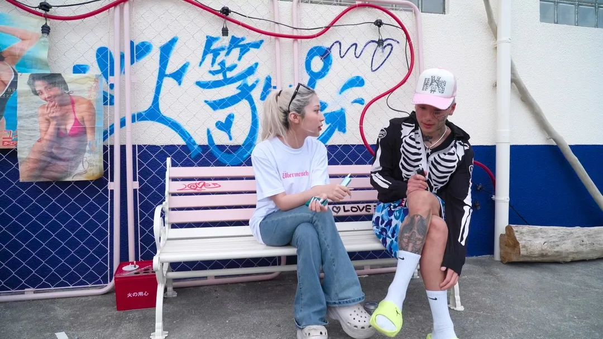

마군과 앗슨의 초중반 관계 흐름은 Netflix Japan 공식 영상에서도 확인할 수 있습니다.



## 불량 연애2 최종 커플 결과

아래에는 `불량 연애2` 졸업식 최종 선택 결과가 포함됩니다.

스포일러 보기: 불량 연애2 최종 선택 결과

| 출연자 | 최종 선택 | 결과 |
|---|---|---|
| 마군 | 앗슨 | 커플 성립 |
| 앗슨 | 마군 | 커플 성립 |
| 하짱 | 보 | 불발 |
| 보 | 히카루 | 불발 |
| 아리 | 히카루 | 커플 성립 |
| 히카루 | 아리 | 커플 성립 |
| 마리린 | 타이짱 | 불발 |
| 타이짱 | 루루 | 불발 |
| 카즈군 | 루루 | 커플 성립 |
| 루루 | 카즈군 | 커플 성립 |
| 레오 | 루루 | 불발 |

### 성립 커플

| 커플 | 흐름 |
|---|---|
| 마군 ↔ 앗슨 | 정학 위기까지 있었지만 서로를 선택 |
| 아리 ↔ 히카루 | 마지막까지 마음이 맞은 커플 |
| 카즈군 ↔ 루루 | 루루를 둘러싼 경쟁 속에서 성립 |

### 엇갈린 선택

| 선택 | 결과 |
|---|---|
| 하짱 → 보 | 보가 히카루를 선택하며 불발 |
| 보 → 히카루 | 히카루가 아리를 선택하며 불발 |
| 마리린 → 타이짱 | 타이짱이 루루를 선택하며 불발 |
| 레오 → 루루 | 루루가 카즈군을 선택하며 불발 |
| 타이짱 → 루루 | 루루가 카즈군을 선택하며 불발 |

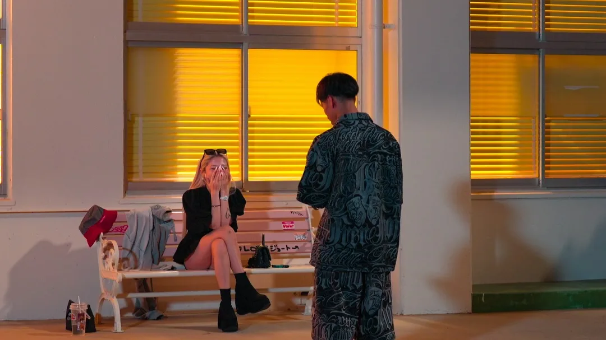

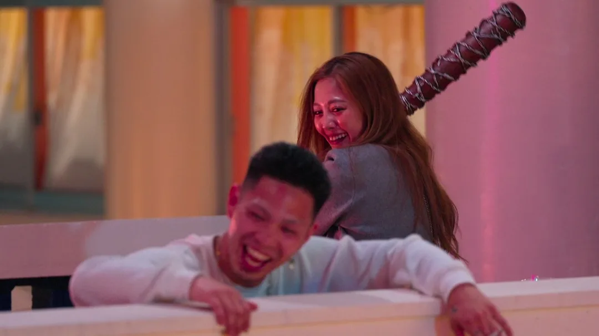

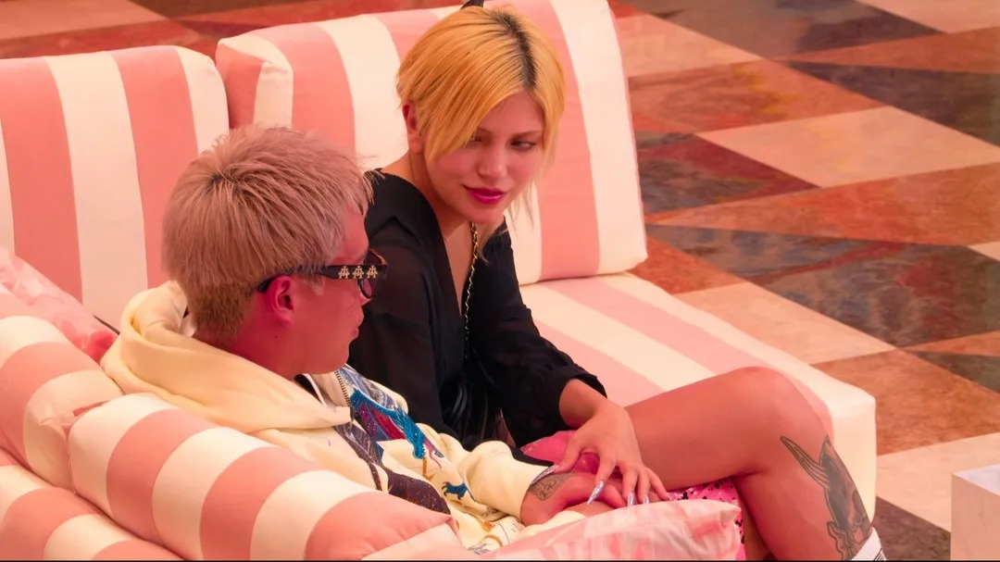

## 루루를 둘러싼 마지막 삼각 구도

졸업식에서 가장 경쟁 구도가 뚜렷했던 쪽은 루루였습니다. 카즈군, 레오, 타이짱의 마음이 루루에게 향했고, 최종적으로 루루는 카즈군과 서로를 선택했습니다.

루루 라인에서 결정적으로 작용한 장면은 카즈군과의 1박2일 데이트였습니다. 이 데이트에서 두 사람이 함께 보낸 시간과 이벤트가 루루의 마음을 크게 움직였고, 최종 선택에서 카즈군을 향하게 만든 중요한 계기가 됐습니다.

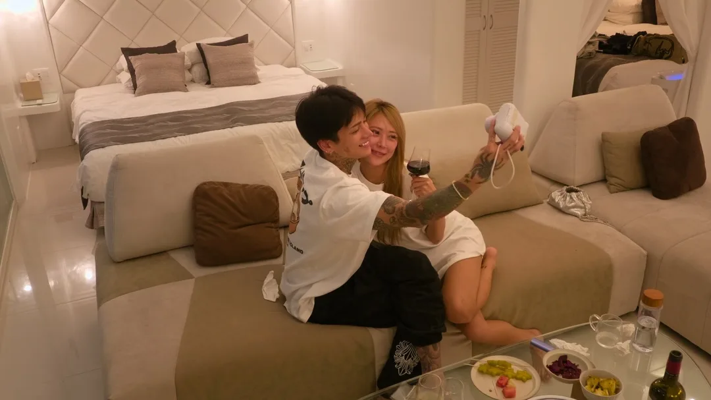

루루 라인은 단순한 인기 구도라기보다, 중간 합류와 관계 변화, 1박2일 데이트의 감정 변화가 겹치면서 마지막까지 선택을 예측하기 어려웠던 축입니다. 그래서 카즈군·루루 커플 성립은 VOL3에서 가장 눈에 띄는 최종 결과 중 하나였습니다.

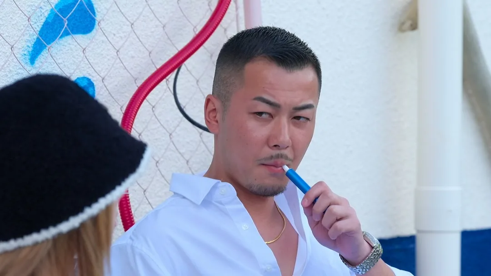

출연진의 나이, 직업, 인스타 정보는 아래 글에서 따로 확인할 수 있습니다.

<a href="/posts/불량-연애2-공개일-출연진-총정리/" style="display:grid;grid-template-columns:minmax(0,1fr) 150px;gap:12px;align-items:center;overflow:hidden;border:1px solid #3b82f6;border-radius:8px;background:#111827;padding:10px 12px;margin:16px 0;color:#f9fafb;text-decoration:none;">
  
    <strong style="display:block;color:#60a5fa;line-height:1.35;font-size:1rem;text-decoration:underline;">불량 연애2 공개일·출연진 나이 직업 총정리｜VOL1·VOL2·VOL3 일정</strong>
  
  
</a>

<a href="/posts/불량-연애2-출연진-인스타-주소-총정리/" style="display:grid;grid-template-columns:minmax(0,1fr) 150px;gap:12px;align-items:center;overflow:hidden;border:1px solid #3b82f6;border-radius:8px;background:#111827;padding:10px 12px;margin:16px 0;color:#f9fafb;text-decoration:none;">
  
    <strong style="display:block;color:#60a5fa;line-height:1.35;font-size:1rem;text-decoration:underline;">불량 연애2 출연진 인스타 주소 총정리｜1위는 누구? 앗슨·카즈군·루루·타이짱 순위</strong>
  
  
</a>

## 졸업식 뒤 진짜 반전, 타이짱 유급

마지막 반전은 졸업식이 끝난 뒤 찾아왔습니다. 최종 선택에서 커플이 성사되지 못한 출연자들이 학교를 떠나는 과정에서 갑자기 전체 방송으로 타이짱이 호출됐습니다.

이미 졸업하는 흐름이었기 때문에 이 시점에 또 다른 교칙위반이 나올 가능성은 낮아 보였습니다. 오히려 시청자는 “졸업 중에 왜 다시 타이짱을 부르지?”라는 궁금증을 갖게 됩니다.

제작진이 타이짱에게 건넨 제안은 `유급`이었습니다. 졸업하지 않고 다시 한 번 학교에 남는다는 설정이고, 스튜디오에서는 이 장면을 통해 시즌2의 2기 시작을 알렸습니다.

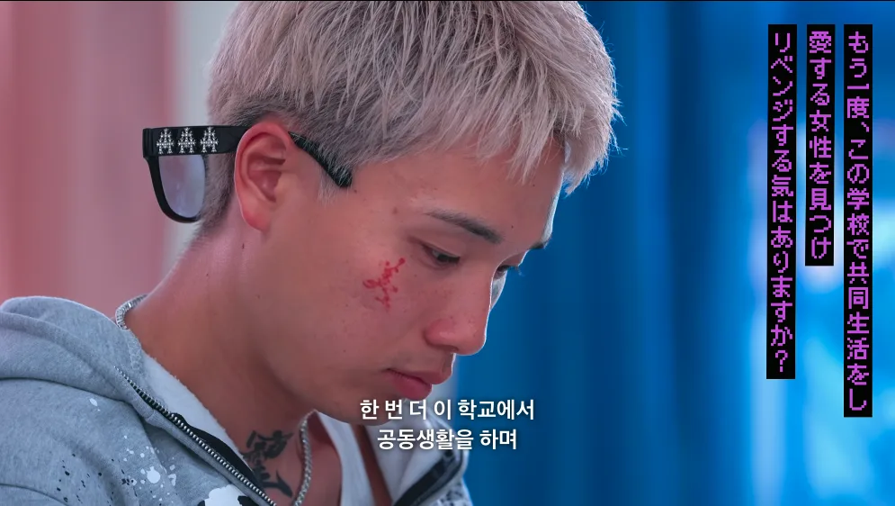

시즌2 종료의 아쉬움과 반전의 도파민이 교차하는 순간이기도 했습니다. 졸업식으로 모든 이야기가 정리되는 줄 알았던 타이밍에, 타이짱 한 명을 다시 교실에 남기며 다음 이야기의 문을 열었기 때문입니다.

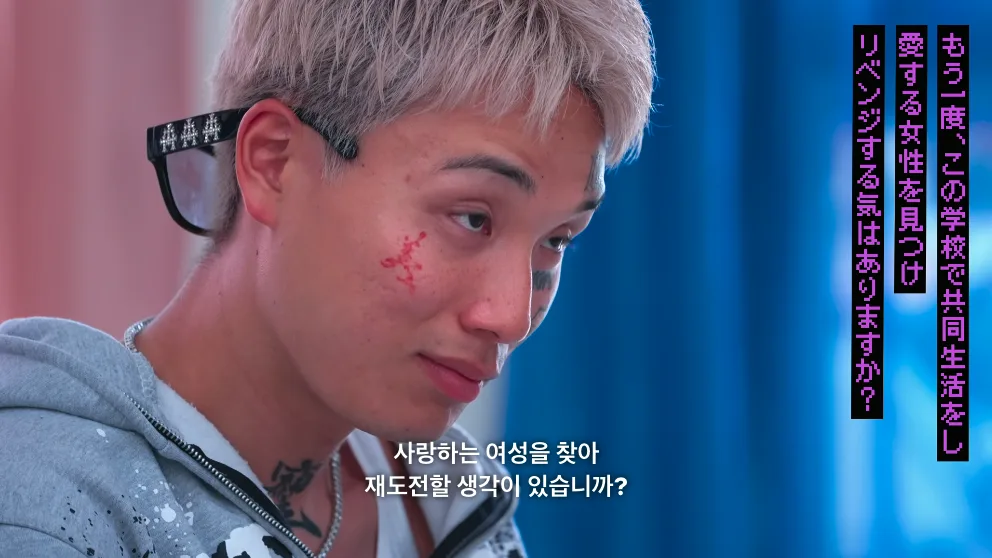

유급이 결정된 뒤에는 새로운 남성 출연자들이 한꺼번에 교실로 밀려 들어오는 장면이 이어졌습니다. 누군가는 칠판지우개를 타이짱에게 던지며 시비를 걸었고, 분위기는 곧바로 몸싸움 직전의 긴장감으로 번졌습니다.

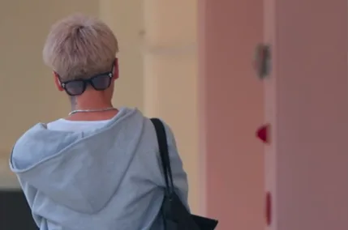

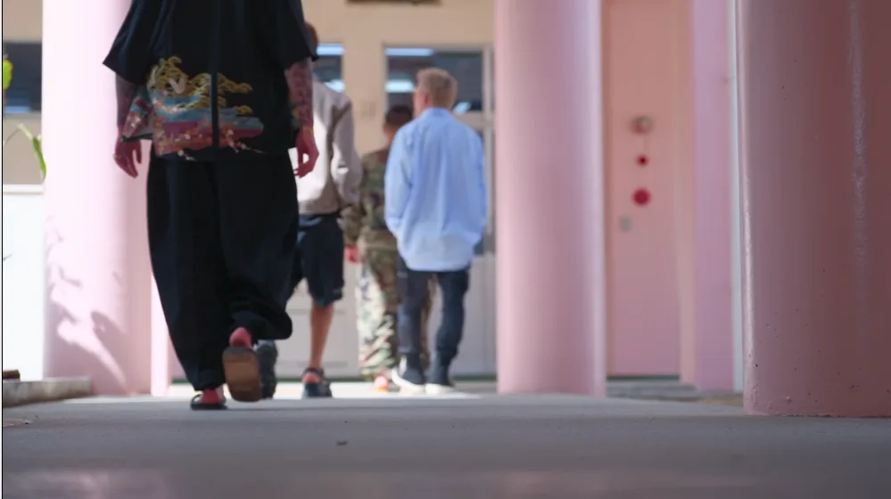

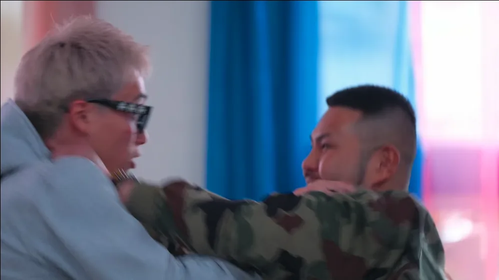

이 장면은 단순한 장난이라기보다 `불량 연애` 특유의 첫인사를 다시 보여주는 연출에 가깝습니다. 처음부터 말보다 충돌로 시작하고, 그 충돌 속에서 관계가 만들어지는 방식이 시즌2 2기에서도 반복될 것임을 예고한 셈입니다.

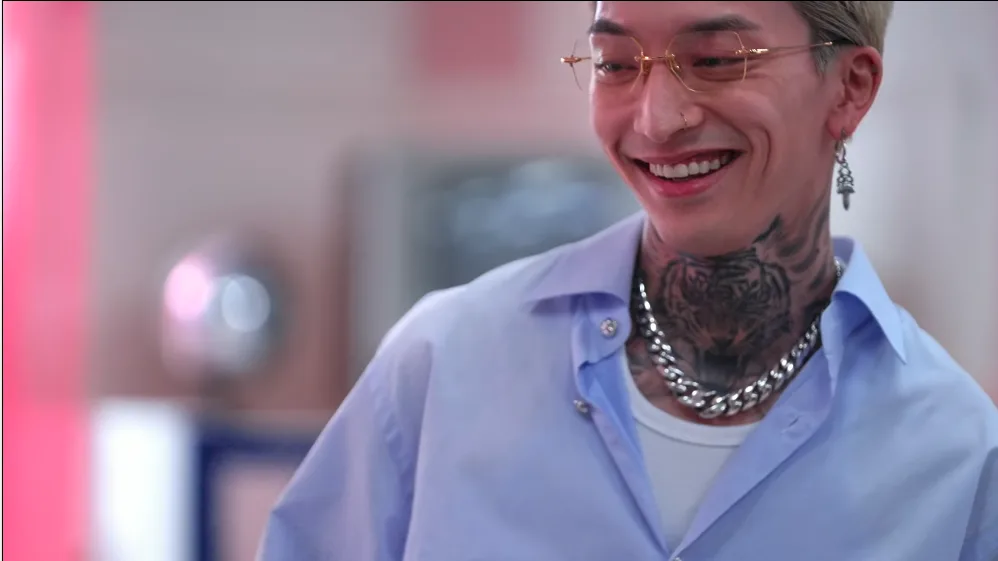

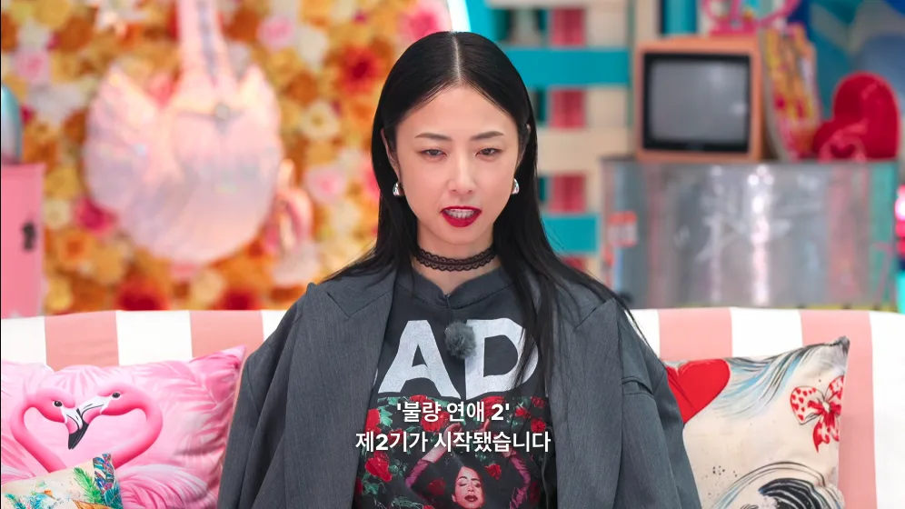

## 불량 연애2 시즌2 2기 공개 일정

넷플릭스에서는 시즌2 2기 공개 일정도 이어서 공개했습니다. 시즌2 2기도 총 10화 분량이며, 실제 출연자들이 약 2주간 합숙하는 형식으로 진행됩니다.

| 구분 | 공개일 | 회차 |
|---|---:|---:|
| 시즌2 2기 1차 | 2026년 8월 25일 | 11-13화 |
| 시즌2 2기 2차 | 2026년 9월 1일 | 14-16화 |
| 시즌2 2기 3차 | 2026년 9월 8일 | 17-20화 |

타이짱의 유급은 단순한 장난식 엔딩이라기보다, 다음 공개분으로 시청자를 바로 이어가게 만드는 장치였습니다. 졸업식으로 시즌2가 끝나는 줄 알았던 흐름에서, 한 명을 다시 학교에 남기며 새로운 관계 구도를 열어둔 셈입니다.

2기 출연자 정보는 아직 별도로 정리된 공식 명단이 공개되지 않았습니다. 다만 시즌2 관련 티저와 출연진 이미지가 Netflix Japan 공식 채널을 통해 먼저 공개되어 온 흐름을 보면, 2기 출연자 정보 역시 Netflix Japan 공식 인스타그램에서 먼저 공개될 가능성이 있습니다.

## 시즌1 졸업식과 비교하면

`불량 연애`는 시즌1에서도 졸업식이 단순한 마지막 행사가 아니라 최종 고백의 무대였습니다. 시즌1은 졸업식에서 최종 선택과 각자의 성장을 함께 보여주며 마무리됐고, 시즌2도 이 구조를 이어받았습니다.

다만 시즌2는 마지막에 타이짱 유급이라는 장치를 붙이면서, “졸업”이 완전한 끝이 아니라 다음 기수의 시작으로 이어질 수 있다는 반전을 만들었습니다.

<a href="/posts/불량-연애-시즌1-출연진-결말-총정리/" style="display:grid;grid-template-columns:minmax(0,1fr) 150px;gap:12px;align-items:center;overflow:hidden;border:1px solid #3b82f6;border-radius:8px;background:#111827;padding:10px 12px;margin:16px 0;color:#f9fafb;text-decoration:none;">
  
    <strong style="display:block;color:#60a5fa;line-height:1.35;font-size:1rem;text-decoration:underline;">불량 연애 시즌1 출연진·결말 총정리｜시즌2 보기 전 복습</strong>
  
  
</a>

## FAQ

### 불량 연애2 최종 커플은 누구인가요?

최종적으로 마군·앗슨, 아리·히카루, 카즈군·루루가 커플로 성립됐습니다.

### 불량 연애2 교칙위반자는 누구였나요?

7화 엔딩에서 예고된 교칙위반의 주인공은 앗슨이었습니다. 허용된 시간 외 음주와 이후 반복된 규칙 위반으로 정학 처리를 받았습니다.

### 앗슨은 퇴학인가요?

완전한 퇴학은 아니었습니다. 정학 처리로 잠시 학교를 벗어났다가 다시 돌아왔습니다.

### 타이짱 유급은 무슨 뜻인가요?

졸업식 이후 제작진이 타이짱에게 다시 학교에 남는 `유급`을 제안한 장면입니다. 이 장면은 시즌2 2기 시작을 알리는 반전으로 이어졌습니다.

### 불량 연애2 시즌2 2기는 언제 공개되나요?

11-13화는 2026년 8월 25일, 14-16화는 2026년 9월 1일, 17-20화는 2026년 9월 8일 공개 일정입니다.

## 관련 글

  

    <a href="/posts/불량-연애2-교칙위반-퇴학-7화-엔딩-정리/" style="display:block;color:#f9fafb;text-decoration:none;">
      
      <strong style="display:block;color:#f9fafb;margin-top:8px;line-height:1.35;">불량 연애2 교칙위반 누구?｜7화 엔딩 규칙위반·퇴학 예고 정리</strong>
    </a>
    <a href="/posts/불량-연애2-공개일-출연진-총정리/" style="display:block;color:#f9fafb;text-decoration:none;">
      
      <strong style="display:block;color:#f9fafb;margin-top:8px;line-height:1.35;">불량 연애2 공개일·출연진 나이 직업 총정리｜VOL1·VOL2·VOL3 일정</strong>
    </a>
    <a href="/posts/불량-연애2-출연진-인스타-주소-총정리/" style="display:block;color:#f9fafb;text-decoration:none;">
      
      <strong style="display:block;color:#f9fafb;margin-top:8px;line-height:1.35;">불량 연애2 출연진 인스타 주소 총정리｜1위는 누구? 앗슨·카즈군·루루·타이짱 순위</strong>
    </a>
    <a href="/posts/불량연애2-마군-손가락-왜-없나-앗슨-음주-사건-과거/" style="display:block;color:#f9fafb;text-decoration:none;">
      
      <strong style="display:block;color:#f9fafb;margin-top:8px;line-height:1.35;">불량 연애2 마군 손가락 왜 없나｜앗슨 음주 사건 후 공개된 과거</strong>
    </a>
  

## 참고 자료

- [Netflix 공식: Badly in Love Season 2 trailer and key art](https://about.netflix.com/en/news/badly-in-love-season-2-trailer)
- [AV Watch: Netflix「ラヴ上等」シーズン2、8月4日配信開始](https://av.watch.impress.co.jp/docs/news/2124893.html)
- [Netflix Japan 공식 YouTube: 마군·앗슨 관련 영상](https://www.youtube.com/watch?v=vYuU5K6_Dpw)
- [Netflix Japan 공식 Instagram](https://www.instagram.com/netflixjp/)

