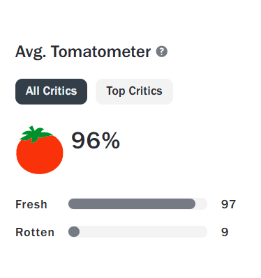
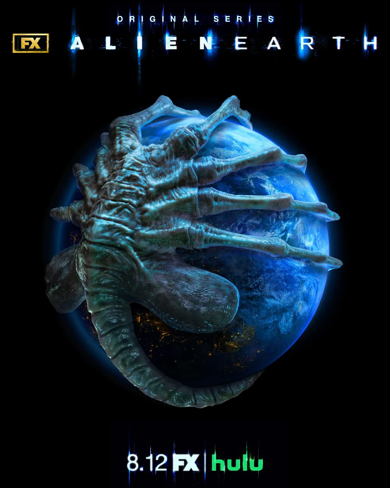

## 소개

2025년 8월 12일, FX의 새로운 시리즈 'Alien: Earth'가 첫 방송을 시작했습니다. 리들리 스콧의 아이코닉한 에이리언 세계관을 TV 시리즈로 처음 선보이는 이 작품은 96% 로튼 토마토 점수로 강력한 리뷰를 받으며 팬들의 뜨거운 관심을 받고 있습니다.

<!--more-->

## 기본 정보

### 방송 정보
- **방송사**: 폭스 온 훌루 (FX)
- **방송일**: 2025년 8월 12일 첫 2화 공개
- **총 회차**: 8부작 구성
- **방송 시간**: 매주 화요일 오후 8시 신규 에피소드 공개
- **국제 스트리밍**: 디즈니+

### 제작진
- **크리에이터/총괄 프로듀서**: 노아 홀리 (Noah Hawley)
- **공동 총괄 프로듀서**: 리들리 스콧
- **제작 규모**: 쇼군(2024)의 2억 5천만 달러 예산보다 훨씬 큰 규모

## 시간적 배경과 세계관

### 시간대
- **배경**: 2120년 (오리지널 에이리언 영화보다 30여년 전)
- **장르**: 1979년 영화 《에이리언》의 프리퀄 작품

### 세계관 내 위치
에이리언: 어스는 기존 영화 시리즈의 시간순에서 다음 위치에 해당합니다:

1. 프로메테우스 (2089-2093년)
2. 커버넌트 (2104년)  
3. **에이리언: 어스 (2120년)** ← 여기!
4. 에이리언 (2122년)
5. 로물루스 (2142년)

## 줄거리

신비한 우주선이 지구에 불시착한 후, 한 젊은 여성과 전술 병사들이 행성에서 가장 위협적인 존재를 발견하게 되는 이야기입니다. 

지구에 추락한 우주선을 수색하던 중 정체불명의 외계 생명체를 만나게 되고, 그들의 무자비한 공격에 맞서 생존을 위한 숨 막히는 사투를 벌입니다.

## 주요 캐스팅

### 주연 배우들

- **시드니 챈들러 (Sydney Chandler)** - 여주인공
- **알렉스 로더 (Alex Lawther)**
- **티모시 올리펀트 (Timothy Olyphant)**
- **에시 데이비스 (Essie Davis)**
- **사무엘 블렌킨 (Samuel Blenkin)**

## 제작 배경과 특징

### 제작 과정
- **2020년 12월 10일** 공식 발표
- **2024년 여름** 촬영 완료, 이후 포스트 프로덕션 진행

### 시리즈의 야심찬 목표
FX는 이 시리즈가 "왕좌의 게임"이나 "더 라스트 오브 어스"와 같은 다음 블록버스터 시리즈가 되기를 희망하고 있습니다. 익숙한 IP를 새롭게 해석하여 프레스티지 TV와 장르물 모두에서 성공을 노리고 있습니다.

### 확장 가능성
"제한된 시리즈가 아닌 지속적인 시리즈로 설계되었다"고 FX 보스 존 랜드그라프가 밝혔으며, 멀티 시즌으로 확장될 가능성이 높습니다.

## 한국에서의 시청 방법

국제적으로는 디즈니+를 통해 스트리밍할 예정이며, **한국에서는 2025년 8월 13일부터 디즈니+에서 시청 가능**합니다.

**시청 방법**
```
1. 디즈니+ 구독
2. 에이리언: 어스 검색
3. 시청 시작
```

## 시리즈의 의미와 전망

### 에이리언 프랜차이즈의 새로운 전환점
에이리언: 어스는 45년간 이어져 온 에이리언 프랜차이즈를 처음으로 TV 시리즈화한 작품으로, 지구를 배경으로 한 이야기를 통해 새로운 관점을 제시합니다. 

특히 **지구에서 벌어지는 첫 번째 에이리언과의 조우**를 다룬다는 점에서 프랜차이즈 팬들에게 큰 의미가 있습니다.

### 높은 기대와 투자
대규모 제작비와 유명 제작진, 그리고 강력한 캐스팅으로 무장한 이 시리즈는 SF 장르 TV 드라마의 새로운 기준을 제시할 것으로 기대됩니다.

## 결론

에이리언: 어스는 단순한 프랜차이즈 확장을 넘어, **SF 공포 장르의 새로운 가능성**을 제시하는 야심찬 프로젝트입니다. 

리들리 스콧의 원작 세계관을 존중하면서도 독창적인 스토리텔링으로 새로운 팬층을 확보할 수 있을지 주목됩니다.

---

### 💡 시청 팁
에이리언 시리즈를 처음 접하는 분들도 충분히 즐길 수 있도록 설계되었지만, 오리지널 에이리언(1979)을 미리 보시면 더욱 깊이 있게 감상할 수 있습니다.

### ℹ️ 업데이트 정보
이 포스트는 2025년 8월 25일 기준 최신 정보로 작성되었습니다. 추가 정보는 지속적으로 업데이트될 예정입니다.