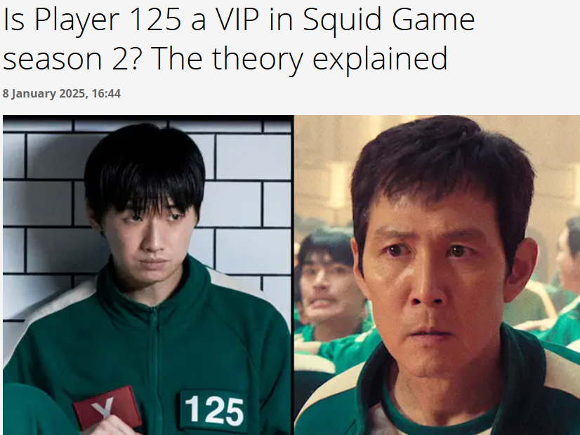
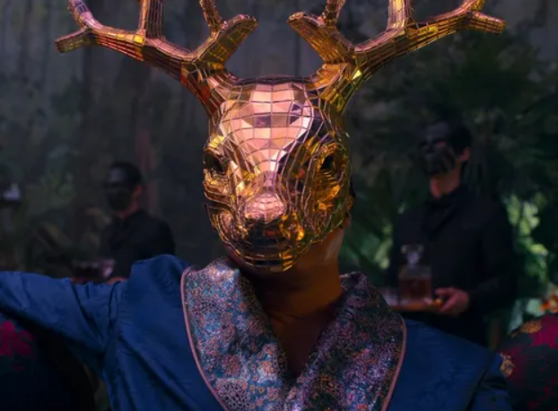
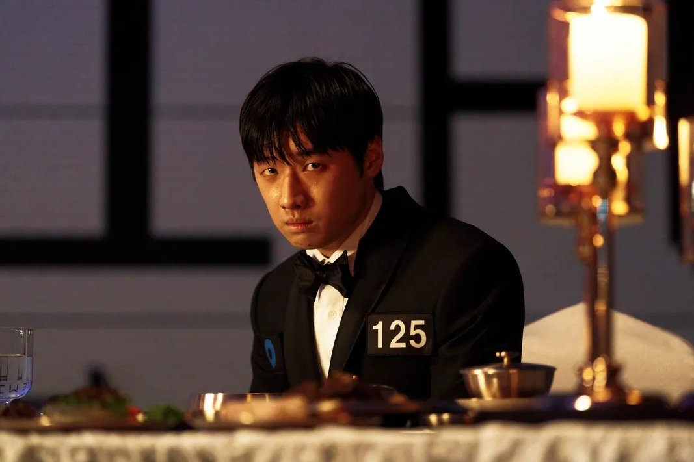
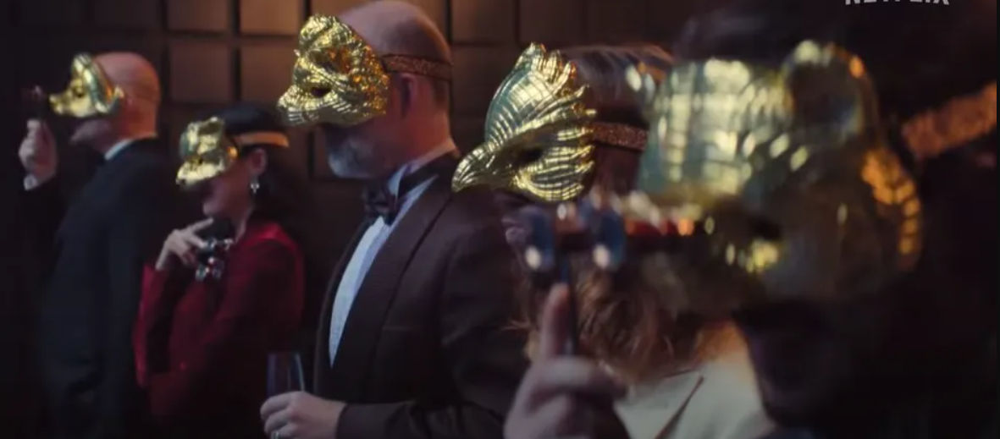

오징어게임 시즌2 방영 후 전 세계 팬들 사이에서 가장 뜨거운 논쟁 중 하나는 바로 민수 VIP 설이었습니다. 125번 참가자 민수(이다윗 분)가 사실은 게임에 잠입한 VIP가 아니냐는 이론이 급속도로 퍼져나갔죠.

## 민수 VIP 설의 기원

이 이론의 핵심은 시즌1 캐스트에 VIP3로 이다윗 배우의 이름이 있다는 점을 근거로 민수가 게임에 잠입한 VIP라는 해석에서 시작되었습니다. 팬들은 황동혁 감독이 7화 쿠키영상에서 암시한 힌트를 토대로 다양한 추측을 펼쳤죠.

## 민수 캐릭터의 모호성
민수는 "매우 소심하고 자신의 의견을 제대로 표현하지 못하는, 쉽게 휩쓸리는 평범한 인물"로 소개되었습니다. 하지만 이러한 소심함이 오히려 의도적인 연기일 수 있다는 것이 VIP 설의 핵심 논리였습니다.

## 팬들이 제시한 주요 근거

다음은 팬들이 제시한 주요 근거입니다:

### 첫째, 캐스팅의 미스터리

시즌1에서 VIP3로 크레딧된 이다윗이 시즌2에서 평범한 참가자로 등장한 것은 단순한 우연일까요? 이는 제작진이 의도적으로 숨겨둔 복선일 가능성을 시사했습니다.

### 둘째, 행동 패턴의 분석
특정 상황에서 보인 여유로운 태도와 운영진에 의해 죽지 않을 것을 아는 듯한 모습에 대한 분석도 있었습니다. 물론 참가자 간 살인이 가능하다는 룰로 인해 완전히 안전하지는 않았지만요. [참고 링크](https://mania.kr/g2/bbs/board.php?bo_table=freetalk&wr_id=6695717)

### 셋째, 오일남의 선례
시즌1에서 오일남이 참가자로 위장했던 것처럼, 민수 역시 비슷한 역할을 할 가능성이 제기되었습니다. VIP들이 게임을 더 가까이에서 관찰하고 싶어할 수 있다는 논리였죠.

## 시즌3에서 밝혀진 진실

그러나 시즌3가 공개된 후, 민수 VIP 설은 공식적으로 부정되었습니다. 이 추측은 잠시 화제가 되었지만, 결국 팬들의 창의적인 추측에 불과했습니다. [참고링크](https://ko.wikipedia.org/wiki/%EC%98%A4%EC%A7%95%EC%96%B4_%EA%B2%8C%EC%9E%84_%EC%8B%9C%EC%A6%8C_3)

황동혁 감독도 "흰 우유를 못 먹는다고 해서 다 부자지간은 아니다"라며 과도한 추측을 일축했습니다.

## 이론이 주는 의미
비록 민수 VIP 설이 사실이 아니었지만, 이 이론 자체가 오징어게임의 서사적 완성도를 보여주는 사례입니다. 이는 캐릭터의 복층성, 제작진의 치밀함, 그리고 팬덤의 높은 참여도를 반영했습니다.

## 결론
민수 VIP 설은 결국 팬들의 창의적 추측에 그쳤지만, 오징어게임이 얼마나 많은 상상력을 자극하는지 보여준 흥미로운 사례였습니다. 때로는 이런 팬 이론들이 작품 그 자체만큼이나 흥미로운 이야기를 만들어내기도 하죠.

민수는 결국 소심하고 평범한 참가자였지만, 그를 둘러싼 이론들은 시즌2와 3 사이의 공백을 메우는 흥미로운 콘텐츠가 되었습니다. 이것이 바로 훌륭한 작품이 가진 매력이 아닐까요?