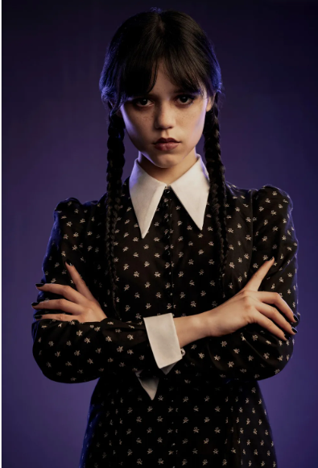
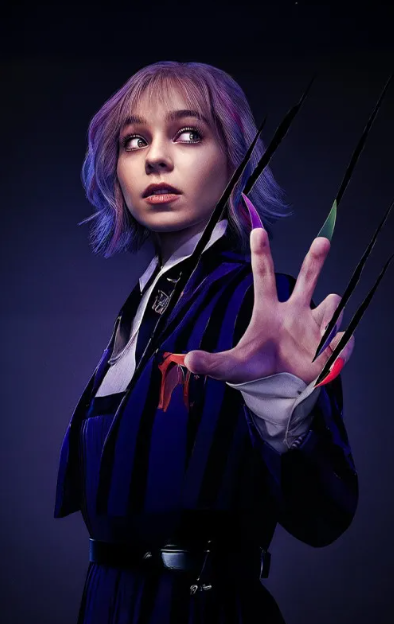
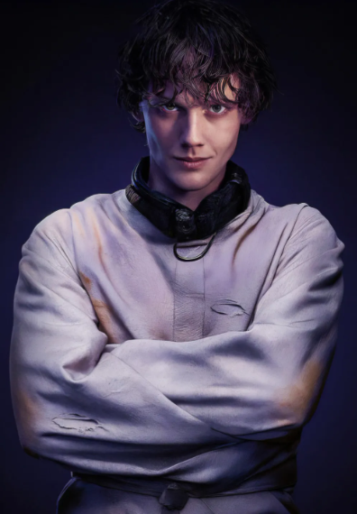
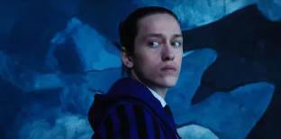
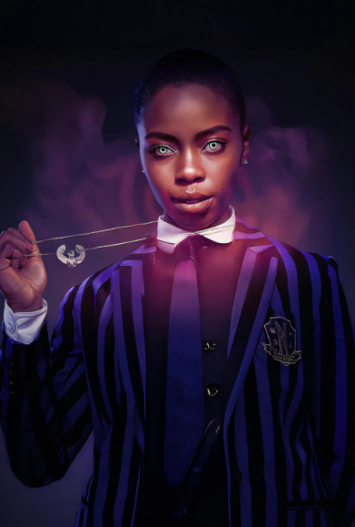
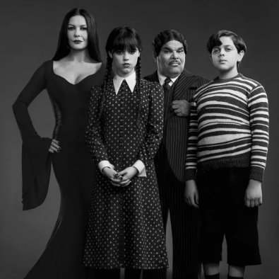

드디어 그녀가 돌아왔습니다! 전 세계를 '웬즈데이 앓이'에 빠뜨렸던 네버모어 아카데미의 가장 유명한 괴짜, **웬즈데이**가 마침내 시즌 2로 우리 곁을 찾아왔습니다!

더욱 기묘하고 거대해진 미스터리와 함께, 동생 '퍽슬리'의 네버모어 입학, 그리고 '스티브 부세미', '레이디 가가' 등 새로운 얼굴들의 등장까지 예고하며 팬들의 심장을 두근거리게 만들고 있는데요.

새로운 시즌의 예측불허 스토리를 100% 즐기기 위해선, 모든 사건의 시작이었던 시즌 1의 핵심 인물들을 다시 한번 돌아보는 것이 필수겠죠? 웬즈데이와 네버모어 친구들이 어떤 관계를 맺었고, 어떤 비밀을 가지고 있었는지 기억을 되살려 보세요!



**웬즈데이**의 매력은 단연 독보적인 캐릭터에 있습니다. 주인공 웬즈데이부터 그녀의 룸메이트, 미스터리한 남학생들과 비밀을 품은 교직원까지, 네버모어 아카데미를 가득 채운 인물들의 이야기를 만나보세요!


## 핵심 등장인물 가이드

### 1. 웬즈데이 아담스 (Wednesday Addams)

**배우:** 제나 오르테가 (Jenna Ortega)

이 드라마의 주인공이자 알파, 그리고 오메가. 까마귀처럼 검은 머리와 절대 웃지 않는 포커페이스, 블랙 앤 화이트 패션이 트레이드 마크입니다. 감정을 드러내는 것을 경멸하고, 어둡고 병적인 것들에 매료되는 고스 소녀죠. 명석한 두뇌와 뛰어난 추리력, 펜싱과 첼로 연주 등 다방면에 능통한 먼치킨이기도 합니다.

동생을 괴롭힌 학생들에게 피라냐를 푸는 복수극으로 네버모어 아카데미에 강제 전학 오게 된 후, 연쇄 살인 사건의 진실을 파헤치기 시작합니다. 자신에게 주기적으로 찾아오는 '환영' 능력을 이용해 미스터리를 풀어가는 모습이 시즌 1의 핵심 줄거리입니다.

### 2. 이니드 싱클레어 (Enid Sinclair)

**배우:** 엠마 마이어스 (Emma Myers)

웬즈데이의 룸메이트이자, 정반대의 성격을 가진 늑대인간 소녀입니다. 웬즈데이가 무채색이라면 이니드는 세상 모든 파스텔 톤을 흡수한 듯한 사랑스러운 캐릭터죠. 활발하고 사교성이 좋으며, 학교 소식을 꿰고 있는 가십걸이기도 합니다.

아직 완벽하게 '늑대화'하지 못해 가족에게 압박을 받는 등 나름의 고민을 안고 있습니다. 처음에는 웬즈데이를 어려워하지만, 점차 그녀를 진심으로 걱정하고 돕는 최고의 친구가 되어줍니다. 

> 웬즈데이와 이니드의 '극과 극' 우정 케미는 이 드라마의 또 다른 관전 포인트랍니다!

### 3. 타일러 갤핀 (Tyler Galpin)

**배우:** 헌터 두한 (Hunter Doohan)

네버모어 아카데미 근처 마을의 보안관 아들이자, 카페에서 일하는 평범한 '노미(normie, 보통 인간)' 소년입니다. 우연히 웬즈데이와 엮이게 되면서 그녀에게 호감을 느끼고, 적극적으로 다가갑니다. 

웬즈데이가 미스터리를 파헤치는 데 여러 도움을 주며 든든한 조력자처럼 보이죠. 다정하고 부드러운 매력으로 웬즈데이의 마음을 조금씩 열게 만드는 인물입니다. **하지만 그에게는 아무도 예상하지 못한 거대한 비밀이 숨겨져 있습니다.**

### 4. 제이비어 소프 (Xavier Thorpe)

**배우:** 퍼시 하인즈 화이트 (Percy Hynes White)

네버모어 아카데미의 문제아이자, 자신이 그린 그림을 현실로 살아 움직이게 만드는 특별한 능력을 가진 소년입니다. 내면의 상처와 고독을 예술로 표현하는 섬세한 감성의 소유자죠. 

어릴 적 웬즈데이와 만난 인연이 있으며, 그녀에게 꾸준히 관심을 보입니다. 하지만 그가 그리는 그림들이 연쇄 살인 사건과 관련되면서 가장 유력한 용의자로 지목받게 됩니다.

### 5. 비앙카 바클레이 (Bianca Barclay)

**배우:** 조이 선데이 (Joy Sunday)

네버모어 아카데미의 여왕벌이자 웬즈데이의 라이벌. 사람을 조종하는 '세이렌' 능력을 가졌습니다. 처음에는 웬즈데이와 사사건건 부딪치며 팽팽한 긴장감을 형성하지만, 이야기가 진행될수록 그녀만의 사정과 리더십을 보여주며 입체적인 매력을 뽐냅니다. 

단순한 악역이 아닌, 자신만의 신념을 가진 캐릭터로 성장해 나갑니다.

### 6. 라리사 위임스 교장 (Principal Larissa Weems)

**배우:** 그웬돌린 크리스티 (Gwendoline Christie)

네버모어 아카데미의 카리스마 넘치는 교장 선생님입니다. 어떤 모습으로든 변신할 수 있는 '변신 능력자'죠. 학교의 평판과 학생들을 보호하기 위해 사건을 덮으려는 모습을 보여 웬즈데이와 대립합니다. 

웬즈데이의 어머니 '모티시아 아담스'와는 학창 시절 룸메이트이자 라이벌 관계였습니다. 언제나 우아하고 당당한 태도를 잃지 않지만, 그녀 역시 학교와 관련된 비밀을 깊숙이 간직하고 있습니다.

## ✨ 특별한 존재: 씽 (Thing)

웬즈데이의 충직한 조력자이자, 이 드라마의 진정한 신스틸러! 살아있는 손 '씽'은 웬즈데이의 부모님이 딸을 감시하기 위해 보냈지만, 곧바로 웬즈데이에게 충성을 맹세합니다. 

말은 못 하지만 풍부한 표현력으로 웬즈데이의 수사를 돕고, 때로는 귀여운 매력으로 시청자들을 미소 짓게 만드는 마성의 캐릭터입니다.

## 기타 주요 인물들

이 외에도 미스터리한 식물학 교사 **마릴린 손힐(Marilyn Thornhill)**과 아담스 패밀리의 '고메즈', '모티시아', '퍽슬리' 등 개성 강한 캐릭터들이 웬즈데이의 세계를 더욱 풍성하게 만들어 줍니다.
---

각자의 비밀과 매력을 가진 캐릭터들이 얽히고설키며 만들어내는 미스터리 스릴러, **웬즈데이**! 아직 안 보셨다면 이번 기회에 정주행해 보시는 건 어떨까요?

**여러분의 최애 캐릭터는 누구인가요?**👇