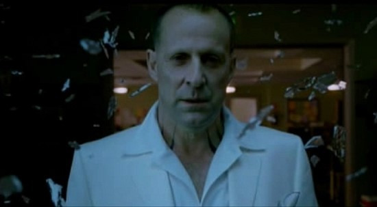
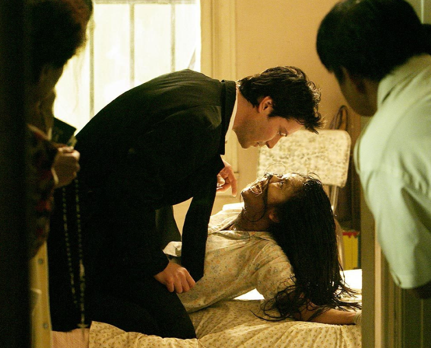
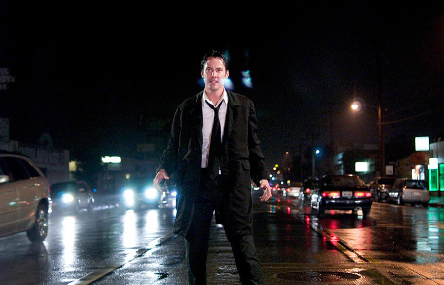
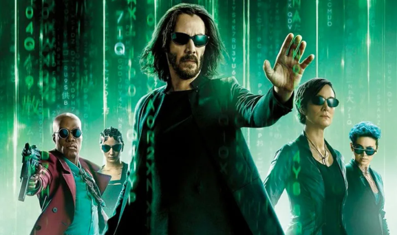
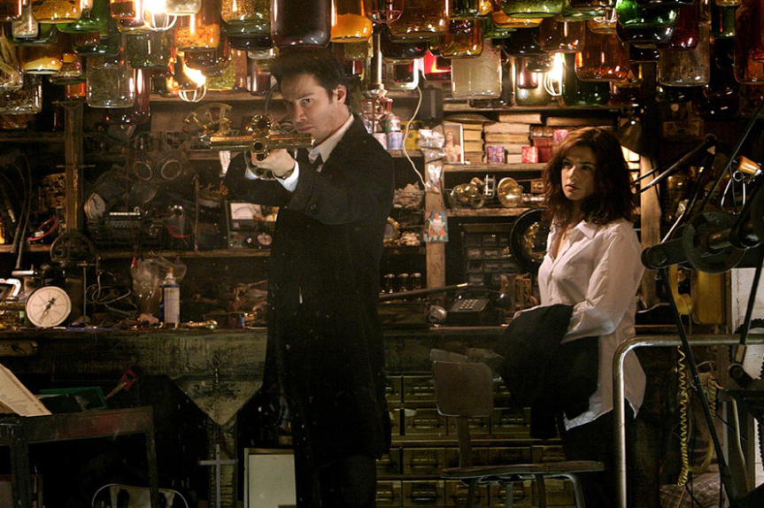
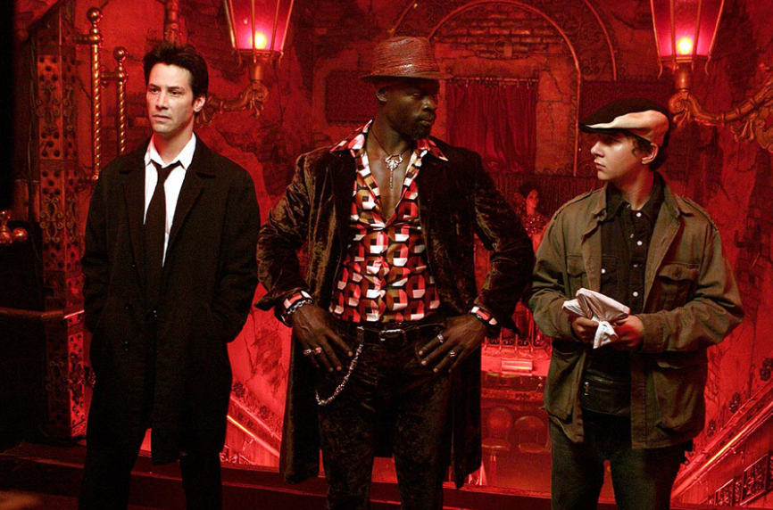
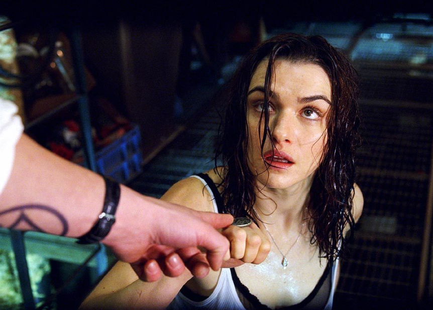

오랫동안 많은 팬들이 기다려온 영화 '콘스탄틴 2'의 제작이 왜 이렇게 더딘 것일까요? 최근 루시퍼 역의 배우 **피터 스토메어**가 **The Direct와의 인터뷰**를 통해 그 중심에 주연 배우 키아누 리브스가 있다는 사실을 밝혔습니다. 단순한 변심이 아닌, 작품과 캐릭터에 대한 그의 깊은 애정과 확고한 비전 때문입니다.

## 키아누 리브스 vs 스튜디오: "이걸 마블 영화로 만들지 말라"

피터 스토메어에 따르면, '콘스탄틴 2' 제작 지연의 핵심적인 이유는 **키아누 리브스가 스튜디오의 각본에 만족하지 못했기 때문**입니다.

**본질을 지키려는 키아누:** 스튜디오는 더 많은 관객을 끌기 위해 '콘스탄틴'을 공중을 나는 자동차와 화려한 액션이 난무하는 블록버스터로 만들고 싶어 했습니다. 하지만 키아누 리브스는 이에 강하게 반대했습니다. 그는 "나는 '존 윅'을 이미 했다. 이 영화는 영적인 영화다"라고 말하며, '콘스탄틴'의 핵심이 악마와 인간 사이의 **영적인 싸움과 오컬트적인 본질**에 있다고 믿으며, 1편과 같이 캐릭터의 깊이와 어두운 분위기를 유지하기를 원했습니다.

**1편에 가까운 속편을 원한다:** 

그는 1편처럼 하나님이 직접적으로 등장하는 장면을 포함하고, 전체적인 톤 앤 매너가 1편에 최대한 가까운 속편을 만들고 싶다는 의지를 분명히 했습니다. 피터 스토메어는 "단순히 액션과 총격전을 추가할 필요가 없다. 다른 영화들이 있지 않나. 이걸 거대한 마블 영화로 만들지 말라"는 키아누의 입장을 전했습니다.

## 캐릭터를 향한 진심: '존 윅'과 '매트릭스 4'의 교훈

키아누 리브스의 이러한 고집은 '콘스탄틴'이라는 캐릭터에 대한 그의 자부심과 애착에서 비롯됩니다.

**액션 연기에 대한 피로감:** '존 윅' 시리즈를 통해 액션의 정점을 찍은 그는 '콘스탄틴'까지 단순한 액션 영화로 소비되는 것을 원치 않습니다.

**실패를 통한 교훈:** 특히 '매트릭스: 리저렉션'의 실패를 거울삼아, 팬들의 기대를 저버리지 않는 '완벽한 속편'을 만들어야 한다는 책임감이 강한 것으로 보입니다. 이 때문에 1편의 프로듀서였던 아키바 골즈먼이 작업한 초기 각본 역시 그의 기준을 넘지 못하고 거절당했습니다.

## 베일에 싸인 '콘스탄틴 2'의 스토리 라인 예측

그렇다면 키아누 리브스가 원하는 '콘스탄틴 2'는 어떤 모습일까요? 그가 직접 언급한 내용을 바탕으로 몇 가지 흥미로운 포인트를 예측해 볼 수 있습니다.

**기억을 잃은 콘스탄틴:** 속편의 존 콘스탄틴은 모종의 마법이나 저주에 걸려 **과거의 기억을 모두 잃은 상태**에서 시작할 수 있습니다.

**돌아오는 캐릭터들:**
- **채즈 크레이머:** 

1편에서 비극적인 죽음을 맞았던 조수 채즈가 '상위 천사'로 승격해 재등장할 가능성이 있습니다. 루시퍼의 유혹에 빠지는 시험을 겪거나, 다시 존의 조력자가 될 수도 있습니다.
- **안젤라 & 가브리엘:** 

젤라는 존이 잃어버린 기억을 되찾는 데 중요한 열쇠가 될 수 있으며, 인간이 된 대천사 가브리엘이 속죄의 길을 걷는 모습이 그려질 수도 있습니다.

**콘스탄틴의 상징, '말보로'의 부재:** 키아누 리브스는 존이 속편에서 **금연을 시작할 것**이라고 언급했습니다. 지옥에 가기 위해 피워대던 그의 상징적인 담배 장면은 더 이상 보기 어려울 전망입니다.

## 마무리하며

'콘스탄틴 2'는 제작진과 주연 배우 사이의 창의적인 방향성 갈등으로 인해 오랜 '개발 지옥'을 겪고 있습니다. 하지만 이는 동시에 키아누 리브스가 캐릭터와 작품의 본질을 얼마나 지키고 싶어 하는지를 보여주는 증거이기도 합니다. 팬들의 오랜 기다림이 헛되지 않도록, 하루빨리 모두가 만족할 만한 각본이 완성되어 스크린에서 다시 한번 존 콘스탄틴을 만날 수 있기를 바랍니다.

### 참고 자료

**피터 스토메어 인터뷰 기사 링크:**
- **Collider:** ["Don't Turn It Into Marvel": 'Constantine 2' Star Reveals Why Keanu Reeves Isn't Happy With Script](https://collider.com/constantine-2-script-keanu-reeves-not-happy-peter-stormare/)
- **CBR:** [Constantine Star Explains Why Keanu Reeves 'Is Not So Happy' With Sequel Script](https://www.cbr.com/peter-stormare-keanu-reeves-constantine-2-script/)