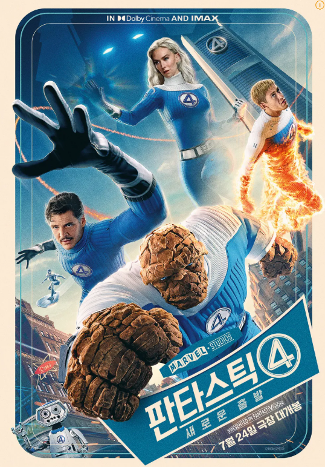
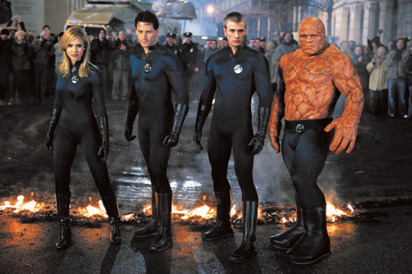
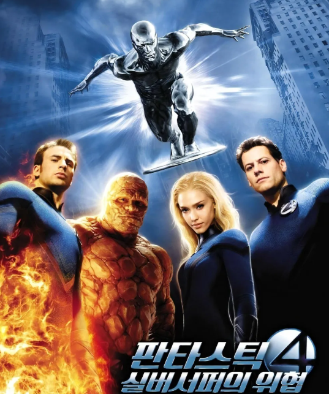
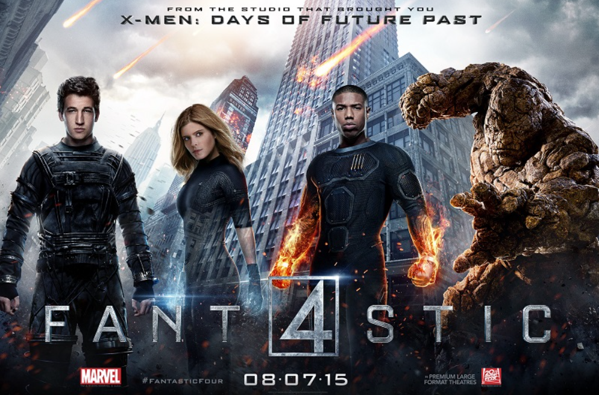
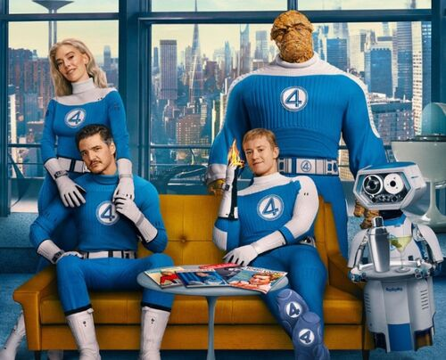
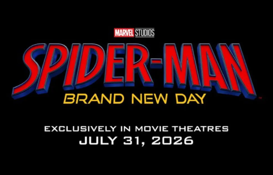
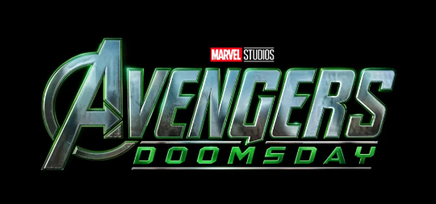
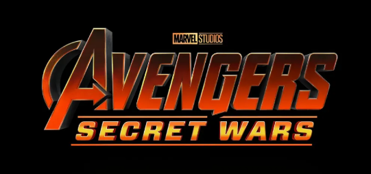

# 판타스틱4 새로운 출발 쿠키 영상 완벽 분석

## 🔍 판타스틱4 쿠키 영상 있나요? (결론부터!)

**판타스틱4: 새로운 출발**에는 **쿠키 영상이 총 2개** 있습니다! 

- ✅ **미드크레딧**: 1개 (메인 크레딧 중간)
- ✅ **포스트크레딧**: 1개 (모든 크레딧 후)

판타스틱4 시리즈를 기다려온 팬들이라면 절대 놓치면 안 되는 중요한 내용들입니다.


**판타스틱4 쿠키 영상 확인 완료**: 총 2개의 쿠키 영상이 있으니 끝까지 기다리세요!


---

## 📽️ 판타스틱4: 새로운 출발 영화 정보

### 기본 정보
- **정식 제목**: 판타스틱4: 새로운 출발 (Fantastic Four: First Steps)
- **개봉일**: 2025년 7월 24일
- **감독**: 맷 샤크먼
- **장르**: 액션, 어드벤처, SF
- **상영시간**: 126분
- **등급**: 12세 관람가

### 판타스틱4 시리즈 주요 캐스팅
- **페드로 파스칼** - 리드 리처드 / 미스터 판타스틱
- **바네사 커비** - 수잔 스톰 / 인비저블 우먼  
- **조셉 퀸** - 조니 스톰 / 휴먼 토치
- **에번 모스배크랙** - 벤 그림 / 더 씽

---

## 🍪 판타스틱4 쿠키 영상 2개 상세 분석

### 1️⃣ 판타스틱4 미드크레딧 쿠키 영상

**📍 등장 시점**: 메인 크레딧 롤링 중간
**⏰ 대기 시간**: 본편 종료 후 약 3분

판타스틱4 새로운 출발의 첫 번째 쿠키 영상에서는 갤럭투스 전투 4년 후의 모습이 그려집니다. 리드 리처드와 수잔 스톰의 아들 **프랭클린 리처드**가 등장하며, 이는 판타스틱4 시리즈의 미래를 암시하는 중요한 장면입니다.

**🔥 핵심 포인트**:
- 어벤져스: 엔드게임의 **루소 형제** 직접 연출
- **어벤져스: 둠스데이**와 직접 연결
- MCU 페이즈 6의 핵심 인물 등장

### 2️⃣ 판타스틱4 포스트크레딧 쿠키 영상

**📍 등장 시점**: 모든 크레딧 완료 후
**⏰ 대기 시간**: 본편 종료 후 약 8분

판타스틱4 시리즈의 오랜 역사를 기리는 레트로 애니메이션이 펼쳐집니다. 1960년대 원작 코믹스 스타일로 제작된 이 쿠키 영상은 판타스틱4 팬들을 위한 특별한 선물입니다.

---

## 🎯 판타스틱4 시리즈 MCU 연결점

### 기존 판타스틱4 시리즈와의 차이점
판타스틱4: 새로운 출발은 이전 판타스틱4 시리즈와 완전히 독립된 새로운 스토리입니다.

- **2005년 판타스틱4**: 20세기 폭스 제작

- **2007년 판타스틱4: 실버 서퍼의 위협**: 20세기 폭스 제작  

- **2015년 판타스틱4**: 20세기 폭스 제작

- **2025년 판타스틱4: 새로운 출발**: 마블 스튜디오 제작 ⭐

### MCU 판타스틱4의 미래
판타스틱4 쿠키 영상을 통해 확인할 수 있는 MCU 연결점들:

1. **어벤져스와의 협력**: 둠스데이 이벤트 참여 예정
2. **뮤턴트 세계관 확장**: X-멘과의 연결 가능성
3. **코스믹 스토리**: 갤럭투스, 실버 서퍼 등장

---

## 📅 판타스틱4 관련 향후 마블 영화 일정

### 🕷️ 스파이더맨: 브랜드 뉴 데이

- **개봉**: 2026년 7월
- **판타스틱4 연관성**: 뉴욕 기반 히어로팀 협력 예상

### ⚡ 어벤져스: 둠스데이

- **개봉**: 2026년 12월  
- **판타스틱4 연관성**: 닥터 둠 본격 등장, 판타스틱4 쿠키 영상과 직접 연결

### 🌌 어벤져스: 시크릿 워즈

- **개봉**: 2027년 12월
- **판타스틱4 연관성**: 멀티버스 사가 완결, 판타스틱4 핵심 역할 예상

---

## ❓ 판타스틱4 자주 묻는 질문 (FAQ)

### Q1. 판타스틱4 쿠키 영상 몇 개인가요?
**A**: 판타스틱4: 새로운 출발에는 총 2개의 쿠키 영상이 있습니다.

### Q2. 판타스틱4 새로운 출발은 리부트인가요?
**A**: 네, 기존 판타스틱4 시리즈와 완전히 독립된 새로운 MCU 영화입니다.

### Q3. 판타스틱4 시리즈 순서는?
**A**: MCU 판타스틱4는 새로운 출발이 첫 번째 작품입니다. 기존 시리즈와는 별개입니다.

### Q4. 판타스틱4 다음 영화는 언제인가요?
**A**: 공식 발표는 없지만 어벤져스: 둠스데이(2026)에서 재등장할 예정입니다.

---

## 🎬 판타스틱4 영화 리뷰 총평

판타스틱4: 새로운 출발은 단순한 리부트를 넘어 MCU의 새로운 장을 여는 중요한 작품입니다. 특히 판타스틱4 쿠키 영상 2개는 앞으로의 MCU 스토리에 핵심적인 역할을 할 것으로 보입니다.

판타스틱4 시리즈를 사랑하는 팬들과 MCU를 따라가고 있는 모든 관객들에게 강력 추천하는 작품입니다.

---

## 🔚 마무리: 판타스틱4 쿠키 영상 놓치지 마세요!

**판타스틱4: 새로운 출발** 관람 시 꼭 기억하세요:

- 🎬 **미드크레딧**: MCU 미래 스토리 예고
- 🎨 **포스트크레딧**: 판타스틱4 시리즈 오마주

판타스틱4 쿠키 영상을 위해 끝까지 기다릴 가치가 충분한 영화입니다!

---

**관련 키워드**: 판타스틱4, 판타스틱4 쿠키, 판타스틱4 새로운 출발, 판타스틱4 시리즈, 판타스틱 포, MCU, 마블, 쿠키영상, 미드크레딧, 포스트크레딧
